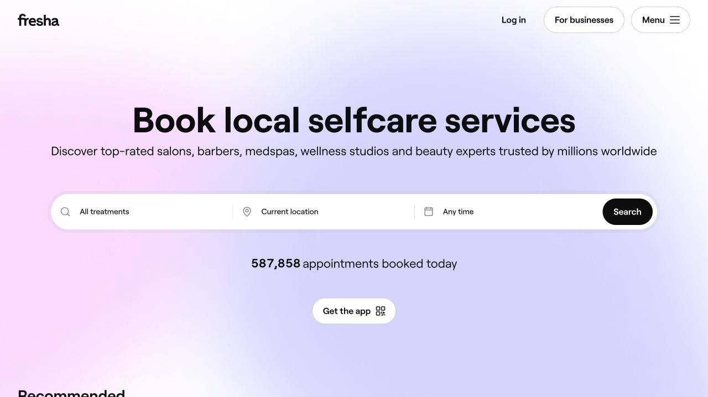
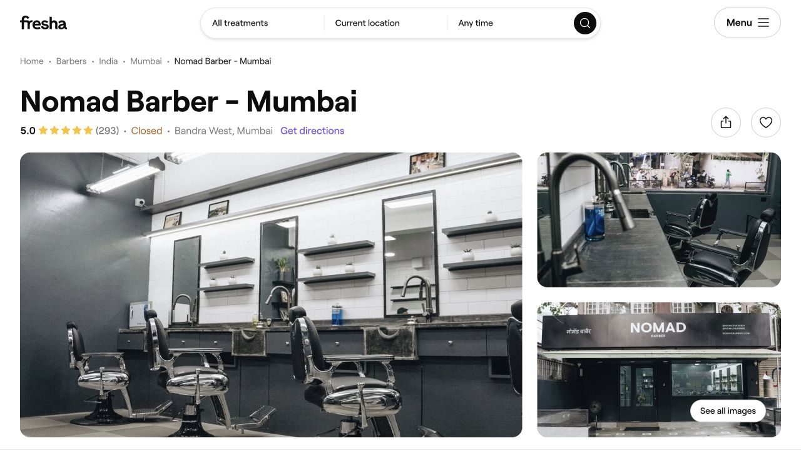
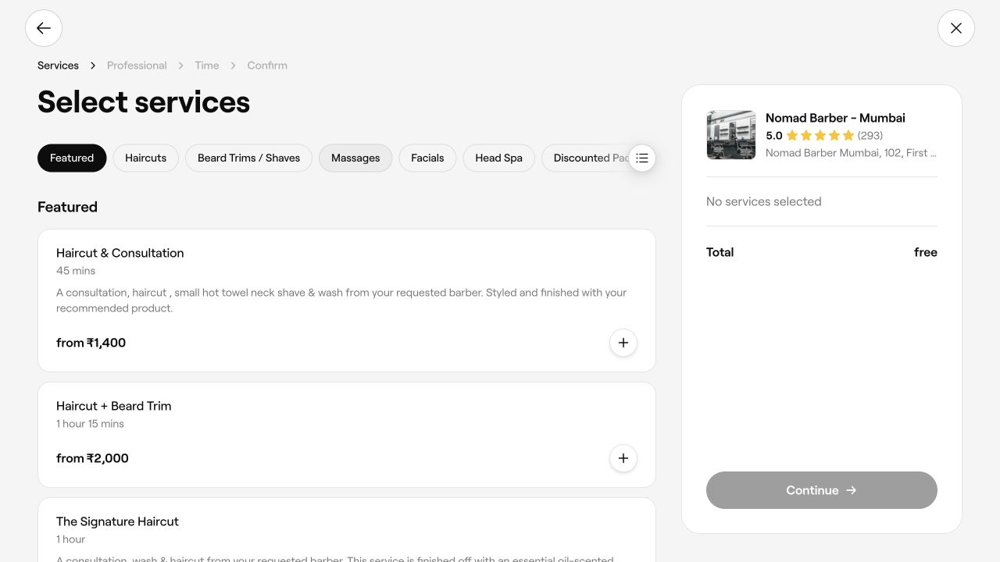

# Fresha Competitive Gap Analysis

**Status:** Strategic benchmark, not approved implementation scope  
**Date:** 2026-08-30  
**Horizon:** 24–36 months  
**Scope:** Core product, UX, operations, payments, customer ecosystem, marketplace, architecture, scalability, and business model. Future implementation requires the relevant PRD and decision-record approvals.

This document is the evidence-based benchmark for the broader strategy:

- [Product vision and roadmap](02-PRODUCT-VISION-AND-ROADMAP.md)
- [Business and client ecosystem](03-BUSINESS-AND-CLIENT-ECOSYSTEM.md)
- [UX, onboarding, and client experience](04-UX-ONBOARDING-AND-CLIENT-EXPERIENCE.md)
- [Implementation master plan](05-IMPLEMENTATION-MASTER-PLAN.md)

## 1. Method and evidence
x
Three evidence classes are kept separate:

1. **Verified in ClipperDesk:** repository code, migrations, routes, tests, and current project-status documentation.
2. **Observed in Fresha:** Fresha's public product, pricing, marketplace, booking, authentication, and help-centre pages on 2026-08-30.
3. **Proposal:** recommended future direction; it is not represented as current product behaviour.

The ClipperDesk review covered `app/Domain`, controllers, middleware, policies, routes, Vue pages, migrations, configuration, billing/payment providers, tests, and the product documents. Important evidence includes:

- `app/Domain/PlatformAccess`: business tenancy, memberships, roles, permissions, support access, auditability.
- `app/Domain/BusinessConfiguration`: locations, services, service categories, staff profiles, availability, resources, imports, readiness, and publish workflow.
- `app/Domain/Scheduling`: appointments, holds, capacity, walk-ins, waitlist, calendar operations, and operational exceptions.
- `app/Domain/ClientRecords`: tenant CRM, notes, consent, forms, attachments, duplicate resolution, preferences, and privacy requests.
- `app/Domain/MoneyCommerce`: sales, taxes, tenders, refunds, deposits, tips, receipts, reconciliation, and cash-close records.
- `app/Domain/Billing`: business-owned Stripe subscription lifecycle and entitlements, separate from appointment payments.
- `app/Domain/Communications`, `app/Domain/Inventory`, and `app/Domain/Reporting`.
- `resources/js/Pages`, `routes/web.php`, `database/migrations`, and the corresponding feature/architecture tests.

Live screenshots are retained in [`docs/evidence/fresha-benchmark-2026-08-30`](evidence/fresha-benchmark-2026-08-30/). The authenticated Fresha workspace was not inspected because doing so would have required creating an external account. The public onboarding entry and Fresha's official setup documentation were inspected instead. ClipperDesk's authenticated setup was evaluated from the source and existing test coverage; the public registration and booking screens were inspected live.

## 2. Executive conclusion

Fresha's strongest advantage is not any one calendar or CRM feature. It is the reinforcing loop between a comprehensive business operating system, consumer identity, payments, and a high-intent discovery marketplace. Its onboarding also asks a small number of segmentation questions before exposing the full workspace.

ClipperDesk's strongest advantage is architectural clarity. It already separates the tenant business, membership access, schedulable staff, subscription entitlements, appointment commerce, and append-only financial evidence. The product has a surprisingly broad operational backend, but several capabilities are hidden behind setup or placeholder experiences and therefore do not create customer-perceived value.

The recommended position is:

> **The dependable operating system for independent and growing beauty and wellness businesses, with direct booking first and an opt-in customer network second.**

ClipperDesk should not make marketplace liquidity a prerequisite for a useful SaaS product. It should first win on activation speed, operational reliability, transparent pricing, client ownership, and excellent direct booking. Consumer accounts and an opt-in marketplace can then compound that installed base.

## 3. Fresha product overview

Fresha presents a two-sided ecosystem:

- **Business side:** calendar, online booking, client management, staff and shift management, checkout/payments, inventory, communications, marketing, reporting, loyalty, packages, memberships, gift cards, business profiles, and multi-location workspaces.
- **Customer side:** discovery, business profiles, services, team profiles, ratings, availability, booking, verified accounts, appointment management, favourites, rebooking, payments, and client-held value.
- **Network layer:** marketplace search, ranking signals, reviews, promoted/featured discovery, booking attribution, and payment-linked monetization.

Its category breadth extends beyond traditional salons. The attached benchmark and public product include salon, barber, nails, spa and sauna, medspa, massage, fitness and recovery, physical therapy, health practices, tattooing and piercing, pet grooming, and tanning.

That breadth is strategically useful but technically consequential. Human wellness, regulated clinical services, and pet grooming do not share the same consent, subject, record-retention, and compliance model. ClipperDesk should use capability profiles and vertical clusters rather than one growing `business_type` string.

## 4. Fresha business model

Fresha combines several revenue mechanisms:

- SaaS access or per-bookable-team-member pricing, with localized plans and terms.
- Payment-processing revenue and paid add-ons.
- A marketplace acquisition fee for qualifying new clients; Fresha's public pricing currently describes returning marketplace clients as free and a one-time fee for a new marketplace client.
- Distribution value through marketplace discovery, direct booking links, social booking buttons, and Reserve with Google.
- Network effects from consumer accounts, booking history, reviews, and rebooking.

Pricing is localized and can change; the benchmark found different price presentations between the current localized page and indexed public content. The durable lesson is the structure, not a copied price: Fresha monetizes the operating system, payment flow, and incremental demand separately.

ClipperDesk currently has business subscription plans and appointment-payment infrastructure, but no marketplace attribution/commission domain, connected-account payout model, consumer network, or add-on catalogue. These should remain separate commercial concepts.

## 5. Why Fresha's workflows work

### Business onboarding

Fresha's documented workspace creation asks for the business name, a primary service type plus related types, team size, and operating model: physical location, mobile operator, or virtual services. It then moves the user into a getting-started path for business details, services, team, shifts, imports, and first booking.

This works because it:

- segments before asking for detailed configuration;
- lets defaults cascade from business hours to team shifts;
- progressively reveals complexity;
- supports owner identity across more than one workspace;
- separates joining a workspace from creating one.

ClipperDesk already has a resumable onboarding session and a rigorous readiness evaluator, but the current Vue experience groups too many fields and operational setup steps into one configuration surface.

### Booking and customer experience

Fresha's public booking follows a legible sequence: service, professional, time, confirmation. Business profiles add photos, ratings, address/directions, amenities, hours, service categories, team portfolios, and nearby alternatives. Customers can browse before signing in, but a verified customer account is required to confirm a booking.

ClipperDesk's public booking already performs availability, holds, deposit, waitlist, confirmation, and secure appointment actions. Its weakness is the discovery and identity layer around that strong booking engine.

### Business operations

Fresha makes staff, shifts, services, payments, clients, and marketplace profile first-class navigation destinations. ClipperDesk implements much of the underlying model, but Staff and Services still route to generic module placeholders in the current product shell. This is the highest-leverage near-term gap: existing backend value is not yet exposed as coherent workflows.

## 6. Fresha strengths

- A recognizable consumer destination, not only merchant software.
- Rich venue and professional profiles that build trust before booking.
- Customer identity makes booking history, reviews, reminders, and rebooking compound.
- Broad operational suite with consistent links between calendar, CRM, payments, team, and marketing.
- Segmented workspace setup and useful default inheritance.
- Multi-location/workspace model and global category reach.
- Payment and marketplace distribution create a reinforcing commercial loop.
- Strong mobile customer behaviour and clear app entry points.

## 7. Fresha weaknesses and competitive openings

These are strategic observations, not allegations about undisclosed internals:

- The breadth can make navigation and configuration dense for small operators.
- Marketplace fees and booking attribution can create perceived conflict over client ownership.
- A business may become dependent on the marketplace for online booking and reviews; Fresha's help centre states that unlisting disables the online profile and booking links.
- Global vertical breadth can produce generic workflows where a focused vertical product could be more precise.
- Dynamic pricing, payment fees, marketplace fees, and add-ons can be harder to predict than one transparent commercial model.
- Consumer-network dependence is a high barrier for new competitors, but also creates an opening for excellent direct booking with merchant-owned relationships.

ClipperDesk should compete with transparent pricing, data portability, direct-booking independence, resilient operations, and purpose-built vertical capability profiles—not with an indiscriminate feature count.

## 8. Current ClipperDesk capability map

### Existing — keep

- Business tenant, memberships, role/permission separation, location scoping, and support audit.
- Stripe business subscription lifecycle and centralized entitlements.
- Separate Stripe appointment-payment intent and webhook boundary.
- Atomic scheduling, slot holds, availability, service segments, resource capacity, walk-ins, waitlist, and secure appointment links.
- Tenant CRM, consent evidence, notes, forms, private files, duplicate handling, and privacy requests.
- Money/tax/refund/deposit/receipt/cash-close evidence and inventory movements.
- Reliable email/WhatsApp infrastructure with consent, templates, quiet hours, callbacks, suppression, and deduplication.
- Operational and financial reporting foundations.
- Multi-location-aware domain relationships.

### Existing — improve or expose

- Onboarding session and launch readiness: strong service layer, overly dense screen.
- Services and staff: rich domain model, missing first-class management UI.
- Dashboard, calendar, walk-in queue, clients, checkout, inventory, and reports: functional but need one connected task model and consistent empty/recovery states.
- Public booking: strong transactional flow, weak public profile and customer continuity.
- Country support: current setup uses a full country catalogue, while older reference configuration remains inconsistent; locale, tax, address, and payment availability are not yet globally complete.
- Multi-location: supported in the data model and authorization, but not yet an enterprise control plane.

### Missing or future

- Global consumer account linked safely to tenant-specific clients.
- Searchable public directory/marketplace, geospatial discovery, reviews, favourites, and ranking.
- Wallet/credit ledger, gift cards, packages, recurring client memberships, and loyalty earning/redemption.
- Merchant connected accounts, payouts, marketplace fees, and dispute allocation.
- Campaign builder, segmentation, attribution, and merchant growth reporting.
- Franchise/enterprise templates, consolidated governance, and cross-location controls.
- Public partner API/webhooks and ecosystem catalogue.

## 9. Detailed capability comparison

| Capability | Fresha | Our Platform | Gap | Priority | Opportunity |
|---|---|---|---|---|---|
| Tenant/workspace core | Mature workspace model | Business tenant, membership, scoped access | Small UX gap | P0 – Critical | Preserve the stronger explicit access boundary and improve workspace switching |
| Guided business creation | Short segmentation sequence | Verified owner creates business, membership, location, and trial; setup follows | Setup is too form-heavy | P0 – Critical | Adaptive wizard backed by existing idempotent provisioning |
| Business-category breadth | Broad beauty/wellness/personal-care taxonomy | Eight broad setup values | Taxonomy and conditional workflow gap | P1 – High | Vertical clusters plus capability profiles; avoid flat enum growth |
| Demo/sample experience | User-observed; not verified in public unauthenticated flow | Dedicated demo seeder, not per-new-account demo mode | No reversible guided demo | P1 – High | Clearly labelled demo workspace/data with one-click purge and no financial side effects |
| Location setup | First-class workspace locations | Full location model and default provisioning | UI maturity | P0 – Critical | Workflow page with hours, contacts, booking readiness, and status |
| Services catalogue | First-class services UI | Categories, add-ons, staff/location/resource assignment exist | Main app uses placeholder | P0 – Critical | Surface the implemented model; templates by vertical |
| Team management | Profiles, roles, shifts, services, locations | StaffProfile separate from User/Membership; permissions and availability exist | Main app uses placeholder | P0 – Critical | Unified team directory with access and schedulability shown separately |
| Availability | Shift-driven booking | Rules, exceptions, service/location/resource constraints | Setup-heavy management | P0 – Critical | Visual schedule editor and inherited defaults |
| Calendar | Mature daily operations | Atomic appointment operations and calendar page | Workflow/polish gap | P0 – Critical | Win on speed, reliability, undo/recovery, and location clarity |
| Walk-in queue | Integrated operational capability | Implemented queue and conversion workflow | Discoverability and mobile QA | P1 – High | Front-desk mode with clear wait, assignment, and conversion states |
| Public booking | Rich profile plus booking | Five-step direct flow, holds, deposits, waitlist | Profile/trust/identity gap | P0 – Critical | Make direct booking best-in-class before marketplace |
| Public business profile | Photos, reviews, amenities, team, map, hours | Basic booking business payload and branding | Rich public profile absent | P1 – High | SEO-indexable merchant-owned profile and embeddable book button |
| Customer account | Verified cross-business account | Anonymous/secure-link customer flow; tenant Client has no user link | Major identity gap | P1 – High | Global CustomerAccount plus consented tenant Client link |
| Appointment self-service | Account and history | Secure token view, cancel/reschedule/rebook | No account history hub | P1 – High | Keep guest links while adding an account timeline |
| CRM | 360-degree client management | Strong tenant CRM and consent foundation | UI/segmentation depth | P1 – High | Make CRM the retention record, not a contact list |
| Forms and consent | Broad client records | Versioned forms, submissions, consent evidence, private files | Limited customer account integration | P1 – High | Pre-visit tasks visible in booking/account timeline |
| Reviews | Verified marketplace reviews | None | Entire capability missing | P1 – High | Completed-appointment eligibility, moderation, replies, appeals |
| Favourites/preferred providers | Consumer network feature | Preferred staff/service exists tenant-side; no cross-business favourites | Consumer layer missing | P2 – Medium | Consumer favourites with strict tenant privacy separation |
| Rebooking | Network/account workflow | Secure rebook link exists | No unified rebook surface | P1 – High | Fast repeat booking from history without marketplace dependence |
| Payments | Integrated merchant/customer payments | SaaS Stripe plus separate appointment Stripe intents | No merchant payout architecture | P0 decision / P2 build | Preserve boundaries; decide merchant-of-record and connected-account model first |
| Deposits/refunds/tips | Integrated | Domain evidence exists | End-to-end launch certification needed | P0 – Critical | Reliability and reconciliation as a differentiator |
| Subscription billing | Team/independent plans | Central plans, prices, entitlements, trials, restrictions | Lifecycle UX still maturing | P0 – Critical | Transparent plan/limit UX and no duplicate subscriptions |
| Wallet/credits | Client wallet | Deposit allocation only | General ledger absent | P2 – Medium | Append-only value ledger shared by credit products |
| Gift cards | Supported | Not implemented | New domain | P2 – Medium | Start merchant-specific; defer network-wide redemption |
| Packages | Supported | Not implemented | New entitlement/value domain | P2 – Medium | Session balance linked to services and locations |
| Client memberships | Supported | Business SaaS subscription only | Naming/domain collision risk | P2 – Medium | Separate `ClientMembership`, billing, benefits, and accounting |
| Loyalty | Supported | No earning/redemption engine | New domain | P2 – Medium | Simple visit/spend rules before complex tiers |
| Inventory/retail | Integrated | Products, levels, movements, sales | UX and supplier depth | P1 – High | Connect service consumption and retail checkout incrementally |
| Communications | Multi-channel marketing/transactional | Reliable email and WhatsApp contracts; no SMS launch or campaign builder | Channel and campaign gap | P1 – High | Unified consented lifecycle communications and measurable delivery |
| Marketing | Campaigns and marketplace growth | Public acquisition content plus templates/consent | Merchant marketing product absent | P2 – Medium | Event-based segments and transparent attribution |
| Reporting | Broad operating reports | Dashboard/report catalogue/export foundation | Retention/cohort/network gaps | P1 – High | Role-aware decision dashboards and metric definitions |
| Marketplace discovery | Major differentiator | None | Major network gap | P2 – Medium | Start with opt-in SEO directory and focused city/category pilots |
| Available-now search | Marketplace inventory | Availability engine exists, no search index | Read-model/search gap | P2 – Medium | Index privacy-safe availability windows, not live tenant queries |
| Ranking/promotions | Marketplace ranking and featured badges | None | Policy and commercial gap | P3 – Future | Transparent quality factors and clearly labelled sponsorship |
| Multi-location | Mature | Location-aware model and reports | Enterprise governance incomplete | P2 – Medium | Shared catalogue templates, consolidated controls, local overrides |
| Franchise controls | Enterprise adjacency | Not present | New hierarchy/permission model | P3 – Future | Add only after multi-location patterns stabilize |
| APIs/integrations | Broad distribution links | Internal web routes; minimal public API | Ecosystem gap | P3 – Future | Versioned partner API, outbound webhooks, accounting/calendar connectors |
| PWA/mobile | Strong customer mobile presence | Responsive Vue web; no verified installable PWA/native app | Mobile continuity gap | P2 – Medium | PWA first; native apps only when retention tasks justify them |
| Globalization | 120+ country positioning | 249-country catalogue, currencies/time zones; incomplete locale/tax/payment depth | Operational localization gap | P1 – High | Capability matrix by country, currency, tax, address, phone, and provider |
| Privacy/security | Mature-platform expectation | Strong tenant scoping, audit, consent, private storage, signed links | Consumer/network privacy model absent | P0 ongoing | Make explicit isolation and consent a marketable trust advantage |

## 10. UX gaps that explain the perceived product gap

1. **Architecture is ahead of navigation.** Services and Staff are implemented as domain concepts but appear as reserved modules.
2. **Setup is organised around configuration fields, not owner outcomes.** The readiness evaluator knows the critical path, but the UI should turn it into short tasks.
3. **The public journey starts at booking, not trust.** It lacks a rich profile, reviews, portfolios, location context, and customer continuity.
4. **Empty states under-sell the product.** New owners need a next action, realistic preview, import path, or reversible demo—not an empty module.
5. **Business state and user intent are not always translated into plain language.** Entitlement, permission, incomplete setup, and payment recovery should each produce distinct UI states.
6. **No consumer home exists.** Secure links solve appointment access, but they do not create a durable relationship across bookings or businesses.

## 11. Technical and business-model gaps

### Technical

- Replace flat business-type options with versioned taxonomy and capability configuration.
- Promote Staff and Services into real routes/controllers/pages without duplicating onboarding logic.
- Introduce global customer identity without exposing one business's CRM record to another.
- Add a value ledger before wallet, gift card, package, membership, or loyalty products.
- Add search/read-model infrastructure before marketplace traffic reaches transactional tables.
- Introduce transactional outbox and replayable projections for search, analytics, and notifications.
- Complete regional capability configuration beyond the country selector.

### Commercial

- Define the promised target segment before widening categories.
- Keep business subscription billing distinct from appointment payment and marketplace revenue.
- Decide whether the platform, business, or payment provider owns merchant risk, disputes, refunds, taxes, and payouts before adopting Stripe Connect.
- Establish marketplace attribution rules that are transparent to merchants and auditable.
- Test subscription, usage, add-on, and marketplace revenue separately; avoid copying a competitor's fee structure.

## 12. Competitive opportunity

ClipperDesk can be better by combining:

- Fresha-level ease of onboarding and consumer confidence;
- more transparent commercial terms and client ownership;
- direct booking that remains useful without marketplace participation;
- stronger explicit tenant isolation, financial auditability, and billing/payment separation;
- workflow depth for selected vertical clusters instead of shallow support for every category;
- predictable recovery for failed payments, availability conflicts, imports, messages, and provider outages.

The immediate competitive move is not a marketplace launch. It is to make the existing operations foundation visible and delightful, drive a new business to its first bookable slot quickly, and create direct-booking experiences that customers trust.

## 13. Source register

Official public sources reviewed on 2026-08-30:

- [Fresha for Business](https://www.fresha.com/for-business)
- [Fresha pricing](https://www.fresha.com/pricing)
- [Fresha features](https://www.fresha.com/en-GB/for-business/features)
- [Fresha marketplace](https://www.fresha.com/for-business/features/marketplace)
- [Fresha Connect](https://www.fresha.com/for-business/features/connect)
- [Create a new Fresha workspace](https://www.fresha.com/help-center/knowledge-base/workspace-settings/40-create-a-new-workspace)
- [Fresha getting started](https://www.fresha.com/help-center/academy/launch-your-workspace/getting-started/lessons/100244)
- [How clients book online](https://www.fresha.com/help-center/knowledge-base/online-profile/101646-learn-how-clients-book-appointments-online)
- [Manage a marketplace profile](https://www.fresha.com/help-center/knowledge-base/online-profile/151-manage-your-marketplace-profile)
- [Fresha packages, memberships, and gift cards](https://www.fresha.com/help-center/knowledge-base/packages-memberships-and-gift-cards)
- [Fresha client wallets](https://www.fresha.com/help-center/knowledge-base/clients/206-manage-client-wallets-1)
- [Fresha loyalty](https://www.fresha.com/help-center/knowledge-base/clients/101624-understand-how-clients-engage-with-your-loyalty-program)
- [Fresha payments](https://www.fresha.com/help-center/knowledge-base/payments)
- [Stripe Connect](https://docs.stripe.com/connect)
- [Stripe Connect SaaS platforms and marketplaces](https://docs.stripe.com/connect/saas-platforms-and-marketplaces)

