# Architecture baseline

This document describes the intended Phase 1 architecture and the verified
Larafast starting point. It is not evidence that a capability is already
implemented; use `project-status.md` for implementation status.

## Verified starting stack

| Layer | Current repository baseline |
| --- | --- |
| Runtime | PHP 8.3+; Node 22.12+ for frontend tooling (Node 24 recommended) |
| Backend | Laravel 13; Eloquent ORM; queues, events, notifications, and scheduler |
| Staff web app | Inertia.js 3 client with Inertia Laravel 2 and Vue 3 |
| UI | Tailwind CSS 4, DaisyUI 5, Heroicons |
| Asset build | Vite 8 and PostCSS 8 |
| Admin | Filament 5 with Livewire 4 |
| Identity | Jetstream, Fortify, Sanctum, Socialite, magic-link code, two-factor support |
| Authorization | Spatie Laravel Permission plus Jetstream team roles |
| Subscription candidates | Cashier/Stripe, Lemon Squeezy, and Paddle-related boilerplate |
| Supporting services | Sentry, Resend, Guzzle, Puppeteer/Browsershot, image and PDF tooling |
| Testing | Pest 4 and PHPUnit 12 |

Exact versions must be read from `composer.lock` and `package-lock.json`.
`CLAUDE.md` currently contains an older package summary and is not authoritative.

### Verified adoption state (2026-08-10)

The foundation audit in
[`audits/2026-08-10-larafast-adoption-audit.md`](audits/2026-08-10-larafast-adoption-audit.md)
verified the following distinctions between installed code and enabled
behavior:

| Area | Verified state |
| --- | --- |
| Jetstream Team | Models, migrations, actions, pages, and tests exist, but Team and invitation features are disabled. Registration still creates a personal Team, so the repository is internally inconsistent. |
| Sanctum API tokens | Package, schema, pages, and tests exist, but Jetstream API support is disabled. |
| Email verification | Fortify feature/routes exist, but `User` does not implement `MustVerifyEmail`; authenticated `verified` middleware is therefore not proof of verified identity for this model. |
| Authorization | One Team policy exists. Spatie roles are global (`permission.teams=false`). No policy was found for invoices or other non-Team application records. |
| Billing | User currently uses Cashier/Stripe. Parallel Stripe and Lemon Squeezy schemas/routes/resources exist. Paddle routes exist without the Paddle package. |
| Admin | Filament access is a global `admin` role or stale `is_admin` fallback; no support-access grant/audit model exists. |
| Operations | Local environment uses MySQL, sync queues, database sessions, file cache, UTC, and has no public storage link or Sentry DSN. These are local facts, not a production topology decision. |
| Security maintenance | Locked PHP dependencies reported 45 advisories across 19 packages; npm reported 19 vulnerable packages (2 critical, 14 high, 3 moderate). |
| Verification | Safe SQLite test run: 41 passed, 10 Team-related failures, 6 disabled-feature skips. Pint reports 19 files. Client and SSR production builds pass with CSS warnings. |

No salon module is implemented. None of the existing generic commerce,
invoice, Team, permission, or admin behavior should be treated as tenant-safe.

## Larafast reuse posture

Every existing feature must be classified during the foundation audit:

| Classification | Meaning |
| --- | --- |
| Keep | Fits the target domain and passes security, quality, and ownership review |
| Adapt | Valuable foundation, but needs tenant, terminology, behavior, or test changes |
| Replace | Conflicts with the target model or carries greater risk than a clean implementation |
| Remove | Unrelated to the product and would add maintenance or security surface |
| Defer decision | Depends on an unresolved market or provider decision |

Likely reuse candidates include authentication flows, account security, the
Inertia/Vue shell, Filament foundations, permission infrastructure, invoices,
provider abstractions, error monitoring, and some subscription plumbing.
None is accepted for production use until audited.

Areas requiring special scrutiny:

- Jetstream `Team` versus the PRD's Business/Tenant and Staff Profile concepts
- overlapping payment providers and subscription/order tables
- user, membership, invitation, and billing ownership
- existing super-admin authorization and support access
- public marketing, blog, roadmap, AI, and product-catalog features
- framework bootstrapping and generated boilerplate conventions

The 2026-08-10 audit supplies the requested classification. Its `Remove`,
`Replace`, and `Defer` entries remain recommendations and do not authorize code
or schema changes.

## Implemented tenant and identity foundation

ADR-006, ADR-008, ADR-009, ADR-012, and ADR-013 are accepted. The access
foundation now implements:

- `Business` is the canonical tenant and root of tenant-owned data.
- `User` is an authenticating identity.
- `Membership` is a first-class User-to-Business access grant with lifecycle
  and business role.
- `StaffProfile` is a Business-owned schedulable worker and may link to a User.
- `Location` belongs to Business from its first migration.
- Business owns SaaS subscriptions, normalized invoices/payments,
  entitlements, provider customer references, imports, exports, and tenant file
  namespace.
- Platform roles are separate from Business roles. Tenant support access is an
  explicit, time-limited, scoped, visible, audited grant.

Authenticated shop routes now use explicit
`/businesses/{business:public_id}/...` context. Middleware resolves an active
Membership before scoped child binding and policy checks, sets the Spatie
Business ID, and clears context after the request. The `/dashboard` convenience
route only redirects to an active explicit Business URL. `current_team_id` is
not consulted.

Business authorization uses dedicated `business_*` Spatie tables. Roles and
direct permissions attach to Membership, giving one User independent access in
multiple Businesses. Starter and custom roles are Business-scoped. Global
platform access uses `platform_role_assignments`, requires verified email,
confirmed TOTP, and protected idle/absolute session windows, may expire, and
does not satisfy Business middleware. ADR-009 support access is a separate
dual-approved Business grant and support session with ticket, reason, explicit
scope, four-hour maximum expiry, tenant-visible banner, and immutable entry,
exit, replay, and revocation evidence. Support endpoints are separate from shop
routes; no grant is treated as a Membership.

Tenant jobs implement `TenantAwareJob` and carry `businessId` plus a correlation
ID. Private object keys, cache keys, export filenames, and search envelopes
include immutable Business identity through application-owned helpers. The
private local disk is a development/default adapter; production object storage
and expiring downloads remain provider/topology work.

## Implemented subscription and entitlement foundation

ADR-021 selects Paddle Billing for Good Hours subscription billing, behind the
application-owned `SubscriptionProvider` interface. Controllers coordinate the
provider request, normalized domain services own transitions, and signed
provider events confirm external state. Browser redirects are never payment
evidence.

```mermaid
flowchart LR
    Owner["Verified owner"] --> UI["Business billing UI/API"]
    UI --> Contract["SubscriptionProvider contract"]
    Contract --> Paddle["Paddle inline checkout / portal / subscriptions"]
    Paddle --> Webhook["Signature-verified webhook"]
    Webhook --> Inbox["Deduplicated provider-event inbox"]
    Inbox --> Lifecycle["Normalized lifecycle service"]
    Lifecycle --> Records["Business subscription, invoices, payments, changes"]
    Records --> Gate["Entitlement evaluator"]
    Gate --> Entry["UI actions, APIs, jobs, imports"]
```



The provider-event inbox stores the unique provider event ID, SHA-256 payload
hash, verified-signature flag, provider creation time, attempts, processing
status, and error. A row lock and unique key make duplicates no-ops. Subscription
updates compare provider creation time with `provider_state_at`; older events
remain evidence but cannot rewind state. Scheduled reconciliation replays only
verified pending/failed events through the same idempotent processor.

Plans and plan prices are effective-dated commercial configuration. Feature and
numeric entitlement definitions are stable operation keys. Plan entitlements
and Business overrides record effective intervals, actor, and reason. Operations
ask the evaluator for keys such as `staff.max` or `inventory.enabled`; they do
not branch on plan names.

Progressive restriction separates commercial state from Business closure:
`past_due` and `grace` warn while allowing normal work; expiry becomes
`restricted` read-only; billing and export recovery remain reachable. A terminal
subscription retains an explicit export window. The later retention decision
and closure executor may close the Business only after required export and
retention behavior is complete.

### Request authorization order

1. authenticate the User and enforce verified email;
2. resolve the Business public ID and active Business state;
3. require an active User-to-Business Membership;
4. activate Business-scoped permission context;
5. resolve child models through the Business relationship;
6. run model/action policy and assigned-Location checks; and
7. clear tenant context after the response.

Actions that issue/revoke invitations or revoke access repeat authorization and
lineage checks rather than trusting the controller. Navigation remains a
presentation layer only.

## Architectural style

Use a modular monolith. Domain boundaries should be visible in namespaces,
services, policies, events, jobs, tests, and documentation even when modules
share one Laravel application and database.

Recommended logical modules:

1. Platform and access
2. Business configuration and catalogue
3. Scheduling and operations
4. Client records and consent
5. Communications
6. Money and commerce
7. Reporting and insights

### Proposed Laravel code organization

Keep one application, one deployment unit, and one primary transactional
database. Express modules inside ordinary Laravel namespaces rather than local
Composer packages or premature services:

```text
app/
  Domain/
    PlatformAccess/
    BusinessConfiguration/
    SchedulingOperations/
    ClientRecords/
    Communications/
    MoneyCommerce/
    ReportingInsights/
  Support/
    Audit/ Files/ Idempotency/ Money/ Observability/ Tenancy/ Time/
  Http/
    Controllers/Shop/ Controllers/PublicBooking/ Controllers/Webhooks/
    Middleware/
  Filament/
    Platform/Resources/ Platform/Pages/ Platform/Widgets/
  Providers/
resources/js/
  Pages/Shop/ Pages/Booking/ Pages/Account/
  Components/
routes/
  web.php  shop.php  booking.php  webhooks.php  api.php
tests/
  Unit/Domain/ Feature/ Integration/ Architecture/
```

Each domain directory may contain the Laravel-native `Actions`, `Contracts`,
`Data`, `Events`, `Jobs`, `Models`, `Policies`, and `Services` it actually
needs. Do not create empty layers or generic repositories. Existing conventional
models such as `App\\Models\\User` may remain in place when moving them adds no
boundary value.

Controllers and UI actions coordinate use cases. Domain services own important
business rules. Eloquent models represent persistence and relationships but
should not become unbounded workflow containers. Policies and tenant scopes
must enforce access independently of navigation.

## Cross-cutting invariants

### Tenant isolation

- Every tenant-owned record has an unambiguous tenant lineage.
- Route binding, queries, relationships, search, cache keys, jobs, exports,
  attachments, notifications, and logs preserve tenant scope.
- Identifiers alone never authorize access.
- Platform support access is reasoned, time-limited, least-privileged, visible,
  and immutable in the audit trail.
- Automated tests attempt cross-tenant access through every data surface.

### Time

- Store real instants in UTC.
- Store the governing location time zone and, where interpretation matters, the
  original local wall-clock intent.
- Availability is calculated in the location time zone and handles daylight
  saving transitions, midnight crossings, holidays, and special hours.
- User-facing messages state the relevant local date, time, and time zone when
  ambiguity is possible.

### Money

- Store monetary values as integers in the currency's minor unit with an
  explicit ISO currency code.
- Centralize rounding, tax inclusion/exclusion, discount ordering, deposit
  allocation, refunds, and totals.
- Successful external payment events are reconciled through verified,
  idempotent webhook handling.
- Corrections create reversals, adjustments, or compensating entries rather
  than deleting history.

#### Implemented appointment-payment boundary (2026-08-15)

`AppointmentPaymentProvider` is a narrow application-owned interface. The
current Stripe adapter creates a payment intent using the same stable
idempotency key as the application record and verifies a signed webhook before
the normalized processor acts. The processor records every verified provider
event, hashes and deduplicates its payload, keeps occurrence time, and makes a
successful charge terminal. A booking Hold is extended while the intent is
pending; only webhook success may confirm the Hold. A failed confirmation opens
a `payment_reconciliation_tasks` item rather than retrying an unknown charge.

Paddle is deliberately limited to Good Hours SaaS subscriptions. It is not
used for appointment deposits, retail, or in-person salon services; those stay
as manual/local tender records until a separate customer-payment provider is
approved. The separate appointment-payment adapter never reuses Paddle billing
payloads as commerce state. Any future gateway must prove the same
webhook/reconciliation suite.

### Capacity and concurrency

- Staff and every required physical resource must be reserved atomically.
- Search results are advisory; commit revalidates all rules and capacity.
- Capacity holds expire deterministically and cannot partially confirm a
  multi-segment appointment.
- Duplicate commands return the original safe result when an idempotency key is
  retried.
- Concurrency behavior is tested with parallel requests against the production
  database engine, not only SQLite.

#### Implemented booking-capacity boundary (2026-08-11)

`App\Domain\SchedulingOperations` now owns the only Appointment timestamp and
capacity write path. `AvailabilityQuery` is advisory; `CapacityHoldCommand`,
`BookingCommitCommand`, and `CapacityHoldExpiryCommand` are the use-case write
contracts for later controllers, calendar actions, jobs, public booking, and
payment coordination. An architecture test prevents controllers, Filament, or
Vue source from importing Appointment persistence or writing its tables.

Search and every write call the same `BookingRuleEngine`. Direct commit and Hold
confirmation re-resolve the FR-03 through FR-07 configuration contract inside
one transaction. Service Lines preserve the effective price/duration/tax/
deposit/segment snapshot; segments and resource claims persist exact half-open
UTC occupancy intervals plus local time-zone intent.

MySQL 8/InnoDB locking follows one order: command-key row, shared Location,
shared Service IDs, eligible Staff IDs, and required Resource IDs. Staff and
Resource roots use `SELECT ... FOR UPDATE`; overlap reads then include active
Appointment statuses and active Holds whose `expires_at` is still in the
future. Resource availability sums quantities. Transactions retry deadlocks up
to five times. Unrelated Businesses do not share lock roots, while
any-qualified services deliberately lock all candidates to make choice and
claim one atomic decision. Candidate-assignment and resource-requirement
discovery use shared locking reads before those exclusive roots; this prevents
a waiting InnoDB transaction from later evaluating conflicts through an older
repeatable-read snapshot.

This foundation implements booking creation, holds, and the initial Confirmed
history row. Prompt 06 now supplies transition, linked replacement,
cancellation, block, manager-policy-override, calendar, walk-in, and
operational-exception commands behind that same boundary. Controllers
tenant-resolve identifiers and local times, then call the use case; Vue may
request but never directly persist an Appointment timestamp.

Prompt 07 adds `App\Domain\PublicBooking` as an adapter/orchestration boundary.
It owns anonymous flow state, hashed purpose links, conversion events, and
waitlist requests/matches, while delegating all capacity and lifecycle writes to
the scheduling contracts above. Public routes are slug-scoped and throttled;
raw tokens are never persisted. A waitlist claim locks every sibling match in
the offer batch before committing through `BookingCommitCommand`, so the public
surface cannot manufacture a second capacity winner.

### Audit and policy history

- High-risk changes record tenant, actor, role, action, target, source, time,
  reason, and a safe before/after summary.
- Critical policies and calculation rules have effective dates.
- Historical forms, prices, durations, taxes, commissions, and policy
  decisions retain the version used at the time.
- Audit data excludes secrets and minimizes sensitive client content.

### Asynchronous work and providers

- External providers are accessed through narrow application-owned contracts.
- Jobs include tenant context, correlation identifiers, retry policy, and
  idempotency behavior.
- Failed work is visible to support and safely replayable when the operation is
  idempotent.
- Incoming webhooks verify signatures, deduplicate event IDs, tolerate
  out-of-order delivery, and retain reconciliation evidence.

#### Implemented communications boundary (2026-08-14)

`App\Domain\Communications` owns FR-13. Operational events become one immutable
intent and at most one `CommunicationMessage` per channel and recipient. The
message key hashes Business, source event, intent, channel, and normalized
recipient; every bounded delivery attempt reuses that provider idempotency key.
Queued jobs implement `TenantAwareJob`, carry the explicit Business and
correlation UUID, and run on the `communications` queue.

`EmailChannelProvider` selects Resend and `MobileChannelProvider` selects Twilio
WhatsApp under ADR-019. Provider payload construction is confined to those
adapters. Resend receives an `Idempotency-Key`; Twilio receives the stable
application correlation ID and an approved Content SID, but its standard
Messages create API has no documented provider-idempotency parameter. The
application therefore prevents duplicate/concurrent creates, never auto-retries
an ambiguous Twilio transport/5xx result, and reconciles by Message SID. Signed
Resend/Svix and Twilio callbacks enter a content-free provider-event inbox.
Unique provider event IDs,
payload hashes, provider occurrence time, and state precedence make duplicate
and out-of-order callbacks safe.

Templates are Business-scoped and versioned by intent/channel/locale. Only the
documented variable catalogue can render. WhatsApp publication requires an
approved provider template. Destinations and variable snapshots are encrypted;
rendered bodies are not persisted, logged, audited, or returned to support.
Only subject/body hashes remain after send. Purpose-bound action records use
short-lived temporary signatures that can be recomputed at delivery, revoked,
or consumed without persisting raw bearer tokens.

Reminder offsets are interpreted from the Appointment instant in its Location
IANA time zone. A candidate inside quiet hours moves to quiet-hours end unless
that would be at or after the Appointment; in that case it moves to one minute
before quiet-hours start. The result is then stored in UTC. Consent, destination
validity, suppression, source cancellation, and reschedule state are checked
again immediately before provider access.

Content-free diagnostics and reasoned replay are tenant settings operations,
not platform-role bypasses. They require the tenant settings permission and
explicit Business ownership. ADR-009 support staff use the same minimizing
service only through an active `communications`-scoped support session whose
Business lineage matches the message; a platform role alone remains denied.

### Files and privacy

- Client attachments are private by default and served through authorized,
  expiring access.
- Object keys, metadata, processing jobs, exports, and deletion workflows carry
  tenant scope.
- Sensitive notes and consent evidence have finer permissions than ordinary
  contact data.
- Searchable Client identity retains tenant-indexed normalized email/mobile
  values; preferences, note content, form answers/signatures/identity evidence,
  and privacy-request details use application encryption at rest.
- Raw form/file/Appointment bearer secrets never persist. SHA-256 digests bind
  a purpose, owning record, Business, expiry, and revocation/use state.
- Client merge is a row-locked, optimistic-versioned aggregate command. It
  moves registered foreign-key relationships, unions tags and preferred
  Services, leaves immutable submitted identity/wording snapshots intact, and
  marks rather than deletes the losing Client.
- Sensitive Client-note reads write a content-free access audit. Preference
  mutations record counts/field names only; free-form preference and note
  values never enter general audit metadata.
- Privacy export is a private, hashed JSON artifact with a section manifest and
  explicit omissions. Internal notes/warnings, security metadata, credentials,
  and bearer tokens are not included.
- Under ADR-018, automated hard deletion and anonymisation are disabled until
  launch jurisdiction and retention periods are approved. Review records the
  retained classes and enters `blocked_policy`; it never silently erases
  financial, consent, or audit evidence.

## Interface surfaces

| Surface | Responsibility |
| --- | --- |
| Shop application | Authenticated dashboard, calendar, queue, clients, checkout, staff, services, inventory, reports, settings, and billing |
| Public booking | Mobile-first discovery, availability, details, policy, payment, confirmation, and secure self-service |
| Platform administration | Tenant operations, subscriptions, provider failures, support access, feature flags, health, and audit |
| Background processing | Notifications, reminders, imports, exports, webhooks, cleanup, reconciliation, and reporting projections |

Public and authenticated endpoints may share domain services, but they have
different authentication, rate-limit, privacy, and abuse-control requirements.

### Implemented frontend shell foundation (2026-08-10)

The Vue/Inertia presentation layer now has three explicit layout boundaries:

- `AppLayout.vue` owns authenticated shop navigation, business-context display,
  desktop rail, mobile drawer, and mobile quick navigation;
- `PublicBookingLayout.vue` owns mobile-first public booking and secure
  self-service presentation; and
- `PlatformAdminLayout.vue` owns the visibly distinct platform-operations
  context and never represents tenant support entry as active.

Remaining unimplemented shop and platform destinations resolve to honest
Inertia placeholders. Business configuration, calendar, queue, public booking,
and secure self-service now contain verified domain behavior. Generic `/book`
and `/manage-appointment` remain privacy-safe entry pages; a Business slug or
opaque secure token is required before public domain data is returned.

The platform shell and action routes use application-owned platform roles and
an explicit capability matrix. Verified email and TOTP are mandatory; platform
sessions expire after fifteen idle minutes or eight absolute hours. Safe
cross-tenant account summaries remain content-minimized. Ordinary tenant data
requires a separate active support session and exact Business/scope match.
Navigation is only presentation; middleware, capability authorization, scoped
queries, support grants, and the replay/export ledgers are the boundary.

Shared primitives live in `resources/js/Components/Product/` and consume the
semantic tokens in `resources/css/app.css`. Page-specific modules compose these
primitives rather than defining new button, form, table, card, modal, toast, or
state semantics. Stable URL parameters should own future location, date, view,
and filter context so responsive navigation does not silently discard it.

The Good Hours identity is an outer presentation layer rather than a domain
dependency. `ProductMark.vue` owns the reusable lockup, the generated mark
lives under `resources/images/brand/`, self-hosted licensed fonts live under
`public/fonts/good-hours/`, and the three shells consume the same semantic
tokens. Tenant-specific booking-page branding must remain data-driven and must
not fork shared component behavior or override accessibility tokens without
validated contrast.

See `design-system.md` for the concrete token, voice, domain, outbound-message,
and component contract. ADR-011 accepts Good Hours and supersedes the temporary
neutral identity in ADR-010.

## Data migration strategy

The first implementation prompt must inventory and classify existing tables
before salon migrations are created. Avoid silently repurposing generic tables
when their semantics or ownership differ.

For every migration:

- define tenant and location lineage;
- define uniqueness within the correct scope;
- choose deletion, anonymisation, or retention behavior;
- add indexes for actual query and conflict-detection paths;
- document historical/versioning behavior; and
- provide factories and tenant-isolation tests.

### Platform-access migration assumptions (2026-08-11)

The access migration is additive for an existing Larafast database:

- legacy `teams`, `team_user`, `team_invitations`, global `roles`/`permissions`,
  and provider/billing tables are preserved; they are not reinterpreted as
  salon tenants;
- new Spatie tables use `business_*` names, avoiding an in-place rewrite of
  unknown legacy role assignments;
- a legacy `admin` role or `users.is_admin=true` is copied into a separate
  `platform_administrator` assignment with a migration reason; normal runtime
  authorization no longer reads either legacy mechanism;
- `personal_access_tokens` receives nullable Business and Membership lineage.
  Existing unscoped tokens remain dormant because API-token UI is disabled and
  are conservatively revoked when any Membership for that User is revoked;
- registration stops creating personal Teams but does not delete existing Team
  rows; and
- no existing Team-to-Business backfill is attempted because Prompt 00 found no
  approved salon tenant data. If meaningful Team data exists in any shared
  environment, it requires a separately reviewed mapping/backfill before that
  environment adopts Business URLs.

MySQL 8/InnoDB is the production schema baseline (ADR-012). SQLite in-memory
tests verify migrations and authorization quickly, but do not claim MySQL
locking, production topology, backup, or restore evidence.

## Observability and operations

Use structured, tenant-safe logs and correlation IDs across HTTP requests, jobs,
webhooks, payment attempts, notification attempts, imports, and exports.
Provide health visibility for queue delays, failed jobs, provider delivery,
webhook age, reconciliation exceptions, and backup status. Never require
routine direct database changes as a support workflow.

FR-20 implements this as read-only health projections plus reviewed recovery
commands. Provider payloads and exceptions remain server-side. Only verified,
idempotent billing/payment events and eligible content-minimized communication
failures have replay adapters; generic failed jobs are not requeued by the
platform. Replay requests carry a reason and unique operation key. Unusual
multi-tenant entry and prohibited bulk export create platform alerts.
