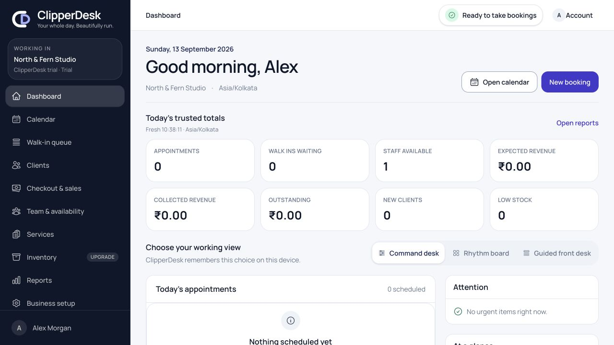
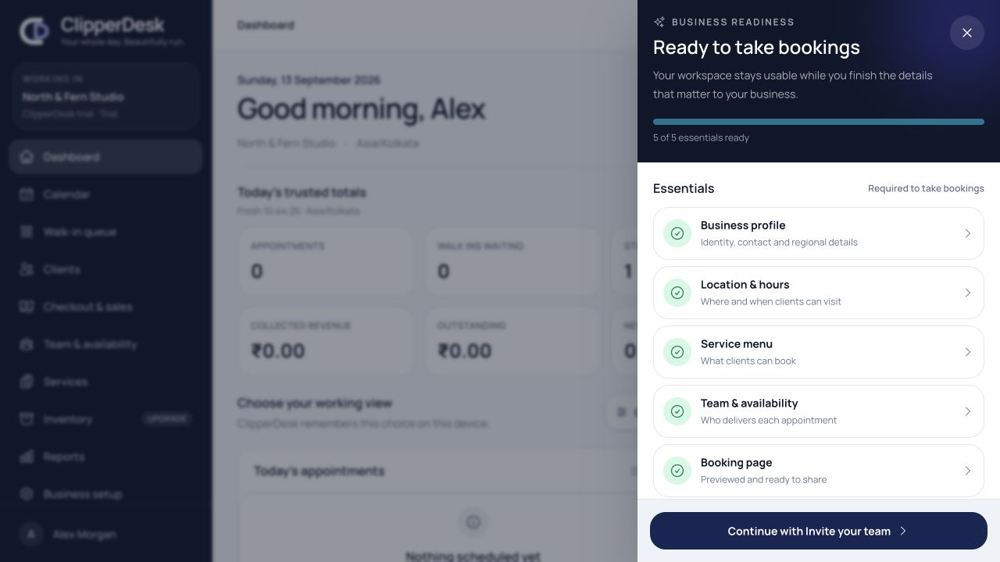
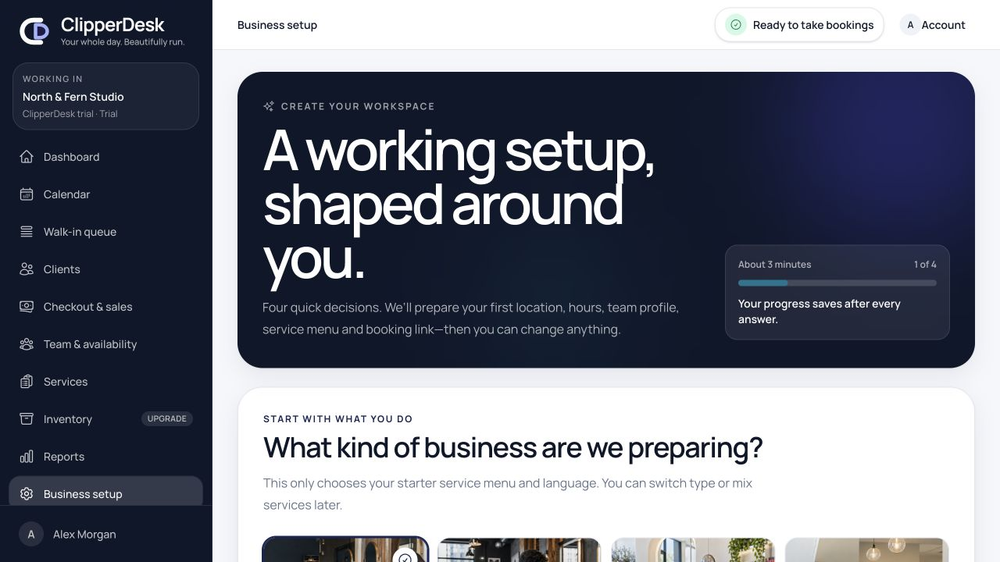
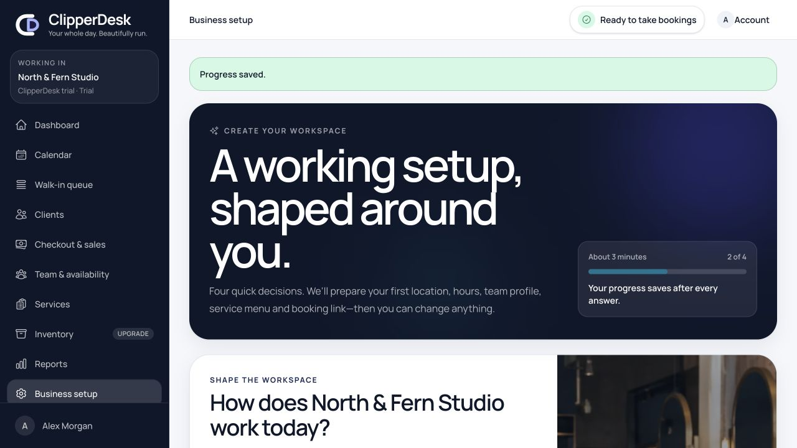
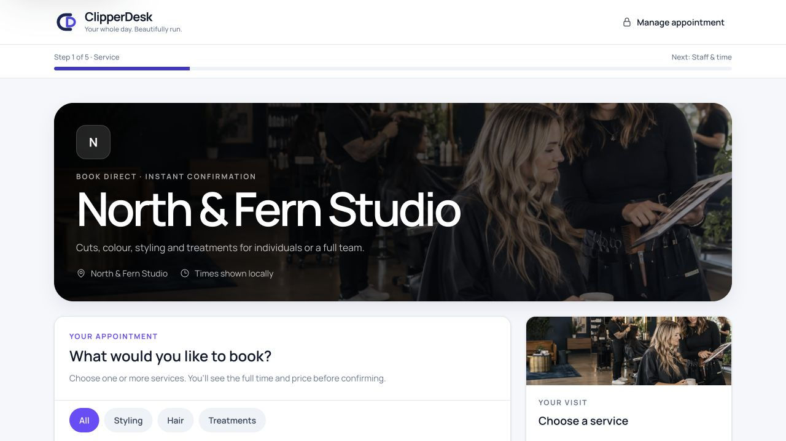

# Adaptive onboarding and booking experience audit

Date: 2026-09-13  
Mode: Combined UX and accessibility audit  
Surface: verified-owner first run, persistent setup guidance, and public booking

## User goal and accessibility target

A new owner should move from verified signup to a usable, personalized workspace
and a professional booking page in minutes. The flow should avoid unnecessary
typing, keep optional work non-blocking, and remain understandable with keyboard,
screen-reader and touch input.

## Flow evidence

1. **Workspace entry — healthy after header refinement.** The working product is
   available immediately and the setup status is visible beside the page title.
   The first capture exposed crowding at the 1280 px desktop boundary; redundant
   subscription and workspace links now wait for the wider 1536 px breakpoint.

   

2. **Readiness drawer — healthy.** Essentials and recommended refinements are
   separated, every row is a direct link, and a single next action prevents the
   panel from becoming another checklist page. The background is inert visually,
   the close control is explicit, and focus/Escape restoration is implemented.

   

3. **Business-type decision — healthy.** Industry imagery makes the choice fast
   and concrete across hair, beauty, wellness and flexible appointment-led
   businesses. The selected state is communicated by border, check icon and
   `aria-pressed`, not colour alone. Copy makes clear that the choice is editable.

   

4. **Operating-shape decision — healthy after scroll correction.** Cards, chips
   and simple binary choices replace text entry. The supporting photograph adds
   warmth without competing with the form. The audit initially found that
   preserved scroll could land this step midway down the page; advancing now
   resets scroll and focus to the main content.

   

5. **Public booking entry — healthy.** Business identity, atmosphere, services,
   categories and the current visit summary are visible before details are
   requested. The booking engine remains passwordless and no payment claim is
   made before a price or deposit is explicitly shown.

   

## Strengths

- Four owner decisions now produce a real Location, hours, owner provider,
  starter Services and booking link instead of a frontend-only demonstration.
- Smart defaults are reviewable and ordinary generated records remain editable
  in their long-term workspaces.
- The readiness model is present throughout the trial but does not block product
  exploration for optional branding, team invitations or advanced rules.
- Realistic editorial imagery is used for pace and confidence; uploaded logo and
  cover assets take over without exposing private tenant storage paths.
- Visible headings, landmarks, labels, pressed/selected states, minimum control
  heights and focus targets are present in the captured accessibility trees.

## Remaining risks and limits

- Screenshot evidence cannot prove full WCAG conformance, screen-reader output,
  browser zoom resilience, reduced-motion behavior or every validation/error
  state. Independent assistive-technology and real-device testing remains a
  release control.
- Starter pricing is a clearly editable baseline derived from currency, not a
  local market recommendation. Product copy must continue to avoid implying
  competitive or regulated pricing advice.
- Multi-location owners receive a ready primary location and a visible expansion
  path; this increment does not automatically invent additional premises or
  staff identities.

## Highest-impact recommendations carried into implementation

1. Keep the first run to the four decisions that materially change safe defaults.
2. End on a live booking preview, share action and populated calendar.
3. Keep Business setup reachable from both navigation and the readiness drawer.
4. Use business photography as an honest fallback atmosphere, then encourage
   simple logo, cover and accent customization.
5. Continue with keyboard, VoiceOver/TalkBack, 200% zoom and real-device booking
   validation before production launch.
