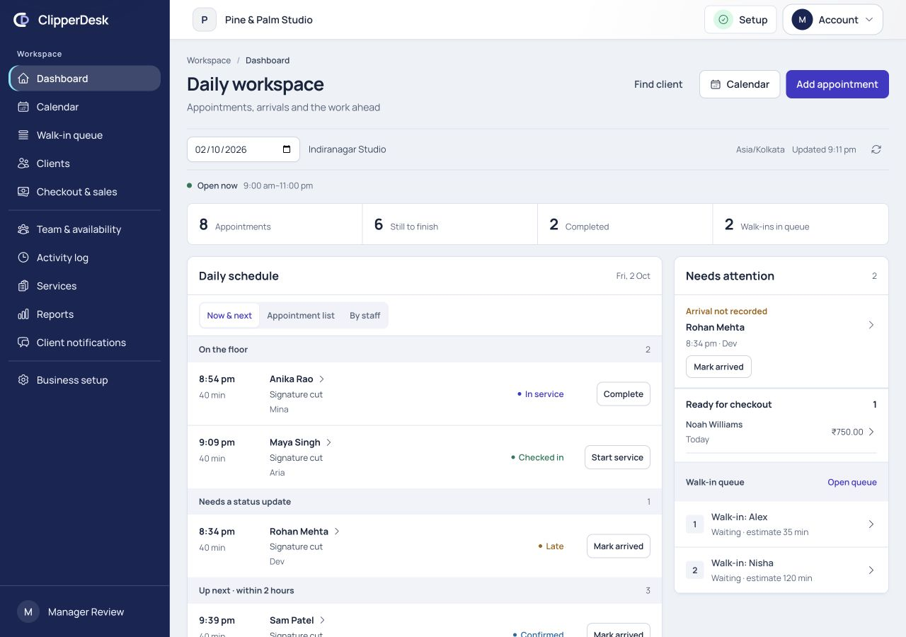

# Dashboard audit and implemented daily workspace

2026-10-02 · Requirements FR-03, FR-05–FR-08, FR-11–FR-12, FR-15–FR-18,
FR-19; PRD sections 10/12. Decision ADR-043. [Implementation contract](../../modules/dashboard.md).

Requested route: `/businesses/01KZS4HVNQZXX1CFZACZZBXR6R/dashboard`.
The shared application implementation was changed. Browser verification used a
separate SQLite business seeded with synthetic appointments, clients, roles,
queue entries and a cash sale. Real business data was not changed. Fixture times
and hours were arranged to exercise current/upcoming/overdue/closed states;
these are scenario fixtures, not evidence of a live salon's behavior. No external
payment or customer message was initiated.

## Audited journey and health

1. **Land and understand the day — corrected.** Before: large greeting and seven
   reporting-style cards displaced operational work; Now/Next could treat a
   completed visit as current and missed unresolved past arrivals. After:
   location/date/time-zone/freshness, compact drillable totals, recorded current
   work, unresolved arrivals, upcoming visits and disclosed finished history.
   Evidence: [before populated](02-before-populated.jpg), [final desktop](16-final-desktop.jpg).
2. **Find urgent work on a smaller screen — corrected.** Before: attention sat
   after the schedule and oversized stacked sections required substantial
   scrolling. After: a compact attention summary on phone/tablet expands to
   appointment actions, unpaid checkout and queue records; current customers
   remain near the top. Counts become a compact four-column phone strip.
   Evidence: [before mobile](03-before-mobile.jpg), [final phone](19-final-mobile.jpg),
   [tablet](15-manager-tablet.jpg). Earlier iteration screenshots 04/05/12 are
   retained as intermediate evidence, not the final phone layout.
3. **Resolve an appointment — verified.** Before: dashboard records mostly led
   back to a general calendar. After: permitted confirmation/arrival/check-in/
   service/completion actions use the existing lifecycle endpoint; details expose
   allowed context and open the exact appointment in the calendar. Browser
   confirmation changed Sam from Pending confirmation to Confirmed, removed its
   confirmation alert and restored trigger focus. The selected unpaid Noah visit
   was selected in checkout with the correct amount due; no browser payment was
   submitted. Evidence: [drawer](06-appointment-drawer.jpg),
   [calendar](07-calendar-deep-link.jpg), [checkout](08-checkout-handoff.jpg).
4. **Respect the operator's responsibility — verified with defined limits.**
   Owner/manager receive location operations plus permitted finances;
   reception receives operational actions/queue/checkout without revenue cards;
   professionals see only assigned visits and their hours; finance-only users
   see sale aggregates without schedule/contact/peer records. Titles are
   descriptive, not authority. Custom permission combinations, missing staff
   linkage, foreign/unassigned locations and withheld fields have automated
   coverage. The linked calendar now withholds contact/notes too, preserves them
   during unauthorized field edits, and restricts notes and printed-location
   access. Evidence: [professional](09-professional-desktop.jpg),
   [finance](10-finance-desktop.jpg), [reception](11-reception-mobile.jpg),
   [manager](14-manager-desktop.jpg).
5. **Handle time and quieter days — verified.** Recorded service remains visible
   beyond its scheduled end; overdue arrivals are not automatically marked
   no-show. Future/history dates do not claim Now/overdue status. Opening hours
   respect the existing resolver; staff windows subtract leave/breaks and do
   not claim attendance/free capacity. Sunday shows closed/date-specific guidance
   and an Open calendar action. Older unpaid checkouts remain actionable across
   dates. Evidence: [closed day](13-closed-day-mobile.jpg); midnight/DST,
   closing-boundary and leave scenarios also have automated coverage.

## Platform inspection and product choices

Reviewed repository instructions, status, PRD/accepted decisions, product design
standards and the implementation behind calendar, booking lifecycle, client
records/forms, services, staff qualifications/availability, local/exceptional
hours, membership roles/custom permissions/location assignment, checkout,
financial reporting, communications outbox, setup readiness, inventory and SaaS
subscription entitlements. Reused the existing shell, tokens, PageHeader,
AppButton/AppSelect, SurfaceCard, StatePanel and native AppDialog. Laravel/Vue/
Inertia versions were taken from manifests/locks.

- Work and resolvable exceptions precede financial reporting. No welcome panel,
  decorative charts, arbitrary scores or generated recommendations were added.
- Appointment statuses, versions, audit and communication behavior remain in the
  lifecycle service; the dashboard adds a whitelist projection, not a scheduler.
- Revenue is labelled Collected/Sale value with its existing governed definitions.
  Unchecked-out visits are explicitly excluded from these aggregates and appear
  separately in Ready for checkout. No false previous-period trend is generated.
- Inventory reporting stays out of the visible operations release under ADR-036.
  The internal stock projection is location/permission/entitlement scoped; the
  dashboard does not expose the disabled stock-report link.
- Attendance, general tasks, client memberships, subscription performance and
  forecasts have no approved operational source in this slice and are not
  fabricated. Staff scheduled is working-window evidence, not physical presence.
- Appointment details are bounded to 100, prioritizing active work before finished
  history. Totals remain exact, and truncation is disclosed. Team availability
  uses eager relations; one versus 21 staff adds no statements after warmup.
  Visible idle data refreshes every minute, pauses during interactions/hidden
  tabs, and follows location-day rollover. No provider calls/charts run on load.

## Accessibility and verification

Statuses include words rather than color alone; meaningful regions/headings,
labelled controls, keyboard actions and visible focus styles are used. The drawer
supports Escape/trigger-focus restoration and an explicit first/last Tab loop
in the shared dialog. Coarse-pointer actions use at least 44px targets;
mobile dates retain 16px text. Status/metadata typography is at least 12px.

Fresh browser checks: owner and manager desktop, professional/finance desktop,
reception 360px phone, manager 768px tablet, 320px drawer, closed-day guidance,
confirmation mutation, exact calendar/checkout navigation and drawer focus.
No page-level horizontal overflow was found at the inspected widths; one main
heading remained. [Narrow drawer](17-mobile-drawer.jpg); [expanded phone attention](18-final-mobile-attention.jpg).
Forward Tab from Close moved to Call, Shift+Tab returned to Close, and Escape
returned focus to the appointment trigger.

- Full PHP suite: **337 passed / 3,654 assertions**, **28 existing intentional
  disabled-feature/MySQL integration skips**, 26.69 seconds.
- Frontend suite: **14 passed**, including five daily-workspace time/priority tests.
- Client and SSR production builds pass using installed Node 24; 17 existing
  frontsite asset-budget entries pass. Scoped Pint and whitespace checks pass.
- Coverage includes exact custom permissions, staff isolation/fail-closed linkage,
  assigned locations, sensitive projection fields, local dates/closing, leave,
  payload cap/active priority, idempotent replay/stale versions, settled and older
  checkouts, constant availability query count and unreadable-field preservation.

## Limits and remaining platform evidence

This is not a fresh production-database audit, observation of real staff at work,
independent security/WCAG certification, sustained-load benchmark or complete
Safari/Edge/Firefox/physical-device test. Synthetic role fixtures and source
contracts establish intended responsibilities; actual usage research was not
available. Transport-failure messages and idle/midnight refresh integration were
source/build reviewed; helper/local-time behavior is automated, but browser
network-fault injection and waiting through midnight were not performed.

The existing Reports previous-period implementation changes local period labels
without rebuilding its copied UTC bounds; it must be corrected/tested before
relying on comparisons. The dashboard deliberately does not consume that trend.
Inventory promotion, provider certification and existing release gates remain
separate; this change does not waive OPEN-10/11/13/14/15/16 or the overall product's
release disposition. Unrelated workspace changes were preserved.

