# Checkout & sales operational review — 2026-10-03

Implemented against FR-14–19 and existing scheduling/Client handoffs. The
[checkout module](../../modules/checkout-sales.md) was restored before changing
behavior. ADR-047 records the approved boundaries; OPEN-18 records the missing
saved-sale amendment/cancellation and controlled attribution-transfer contract.

## Existing implementation and resulting behavior

| Area | Reviewed source and outcome |
| --- | --- |
| Visit origin | Completed Appointment and service snapshots; converted walk-ins share the canonical appointment. Calendar, Queue and Client links retain the exact visit. This workspace does not create an unlinked retail sale. |
| Service pricing | Booked source prices/primary performers remain historical. Added services resolve current eligible branch/staff variants through EffectiveServiceResolver. Server-side owner/manager price overrides and reasoned booked-staff/removal changes are auditable. |
| Retail | Active products, SKU/barcode search, currency and location stock. Aggregate basket quantities and completion stock are revalidated. Private product-cost snapshots stay on the server. No hardware scanner integration is claimed. |
| Discounts/taxes | MoneyCalculator and CommerceSetting own integer minor units, line/order discounts, configured thresholds and inclusive/exclusive tax. Browser approval flags are rejected; taxes are never calculated authoritatively in Vue. Coupon campaigns and jurisdictional tax engines are not implemented. |
| Benefits | No approved implemented client membership, package, gift-card, wallet or loyalty aggregate. Staff Membership and SaaS subscriptions are different domains. No invented benefit controls are introduced. |
| Tips/commissions | Existing staff tip and commission services remain authoritative. Tips can be assigned to multiple eligible staff; each service retains its single primary performer. Stock, commission and tip entries commit at settlement. |
| Payments | Sale, PaymentTransaction, Deposit and DepositAllocation. Partial payments keep the sale open; pay later creates no tender. Split recording is atomic. Only succeeded same-business/appointment/currency payment evidence qualifies a deposit. |
| Providers/cash | External cash/card/bank/link/UPI/other recording after explicit receipt acknowledgement. Stripe appointment intents/webhooks and SaaS billing remain separate. This page does not charge cards or execute provider refunds. Existing CashClose API is retained; no new cash-close screen or terminal integration. |
| Receipts/invoices | Immutable completed-sale receipts with original items/totals/payment evidence; browser Print/Save as PDF. Existing consent-gated payment.receipt event pipeline is reused. No new sending action or regional invoice-certification claim. |
| History/refunds/reporting | Scoped paginated sales, actual attributed staff and branch-local dates. Original values, payment actors, net receipts and append-only refunds stay distinct. Original-method manual return records require reason, acknowledgement and stock disposition. Existing accounting/reporting definitions remain authoritative. |
| Roles/shared UI | Checkout, revenue, discounts, refunds, Client visibility, assigned locations and inventory entitlements are checked on the server. Shared shell, forms, dialogs and selects are reused; the amount-due workspace has its own compact responsive layout. |

## Findings fixed

- The original booking selector/full-payment form did not support a reviewed POS
  basket. The new workspace carries visit context, source services, qualified
  additions, retail stock, item/order discounts and staff tips into a server quote.
- Changed quote prices cannot silently become a saved sale. Preparation binds the
  exact fingerprint and serializes on the appointment; saved items stay fixed.
- Root locks now precede payment/deposit/refund replay checks. Reused keys cannot
  change the original financial command. Duplicate item returns and over-refunds
  are rejected cumulatively. Stock failures roll back the entire split command.
- Raw previews and legacy responses could expose private snapshots. Explicit
  allowlists now exclude contacts, provider evidence and retail costs.
- Browser QA caught a tall split-payment sidebar with empty composer fields,
  mobile table overflow caused by an absolute accessibility header, stale applied
  deposit availability, and staff edits using the wrong addition price. These
  were corrected. Preview retains prior totals while disabling financial actions.
- The amount-due header remains visible above a bounded scrolling payment body.
  Phone checkout has a direct Payment shortcut and fixed due total; the shared
  bottom navigation does not cover its controls. Unsaved item switching is guarded.
- Refund context stays in the dialog header while the item allocation/reason body
  scrolls. Refunds do not reopen a completed sale for another collection or rewrite
  its issued receipt.

## Flow evidence

All images below are actual Chrome captures from this review, saved and visually
inspected. The local/testing-only CheckoutWorkspaceReviewSeeder creates a separate
synthetic Atelier Studio review business, three professionals, eligible services,
branch stock, a verified deposit, a partial sale and paginated history. It uses no
real client contact destinations. Browser review completed one synthetic sale and
recorded one synthetic return; no provider charge, transfer or outbound message
occurred. Unsaved long baskets and the later refund review were discarded.

Health applies to the sampled local flow, not production certification. Full-page
images can show fixed navigation at its viewport position within the longer image.

### 1. Select a visit and review its basket — healthy

Ready visits are compact and separate from financial history. The selected client,
reference, local time, location, source and performers remain visible. Booked prices
are retained; an older sale without item snapshots clearly preserves its recorded
totals. The saved partial sale exposes original total, received amount and remaining
due without asking reception to rebuild it.

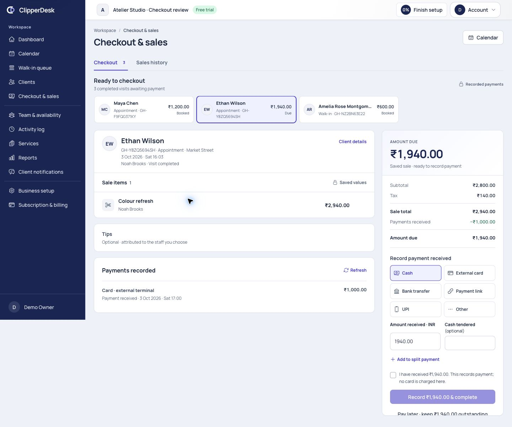
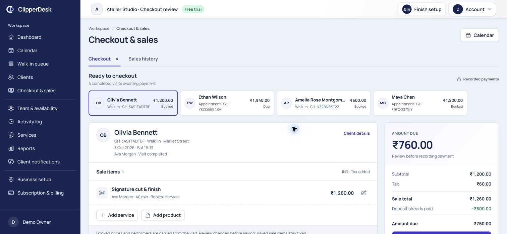

### 2. Add services/products, discounts and tips — healthy

Search opens inside checkout with autofocus, eligible performers and bounded rows.
Retail rows show price, SKU and available stock; unavailable stock is disabled.
Quantity, scope-specific discounts and reasoned overrides remain explicit. Browser
review added two clay products, applied an item discount and staff tip, and changed
an added Conditioning treatment from Ava to Noah without a spurious booked-change
reason. The authoritative refreshed total was ₹1,732.50 for that unsaved basket.

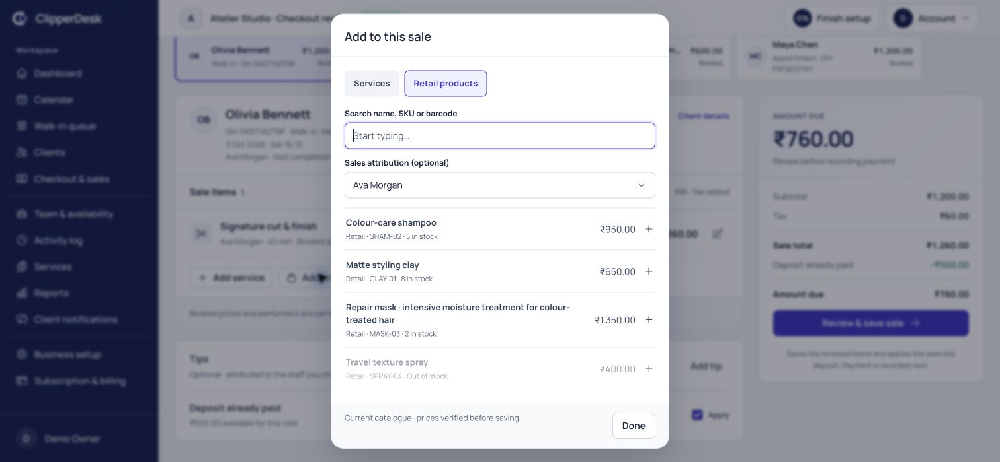

### 3. Record full, partial or split payment — healthy

The method, exact amount and acknowledgement are visible beside due. The synthetic
completed sale had subtotal ₹2,500, discount ₹100, tax ₹120 and tip ₹200: total
₹2,720. A verified ₹500 deposit left ₹2,220, recorded as cash ₹1,000 plus external
card ₹1,220. The separate partial sale remains ₹1,940 due. Its staged split was
reviewed but not recorded. Exact-command replay, changed-key payload rejection,
partial settlement and stock rollback are covered through HTTP tests.

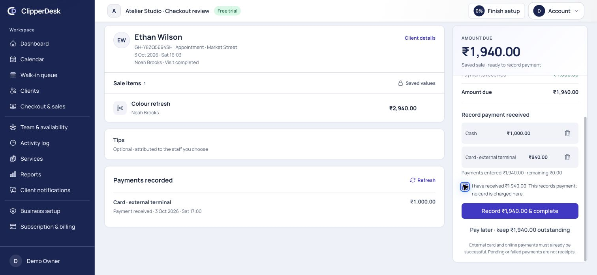
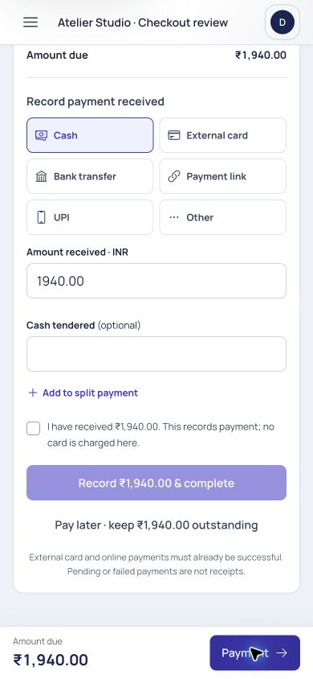

### 4. Complete the sale and issue its receipt — healthy

The completed state offers receipt, rebooking, next visit and Calendar/Queue
handoffs. The actual receipt matches the original service/retail rows, discount,
tax, tip, deposit, two tenders and zero balance at issue. Later refunds retain that
receipt. Full-deposit and complimentary zero-value completion are HTTP-tested and
create no fake cash tender. Existing communication event creation is reused;
actual email/SMS delivery was not exercised.

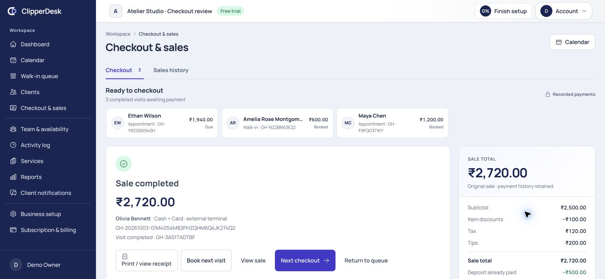
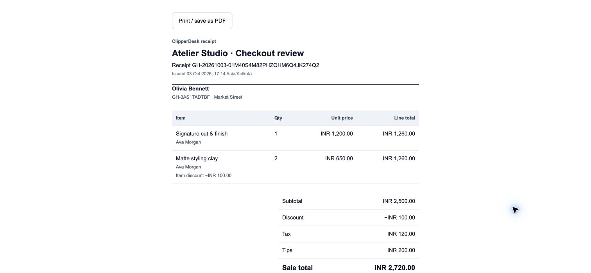

### 5. Search history and inspect a sale — healthy

Twenty-row pages, name/reference/receipt search, status/method and progressive
staff/date/location filters keep history compact. Next retains Sales history.
The reviewed business has 26 sales across two pages. Original item/tax/discount/tip
values are separate from deposits, payments, refund actors and net receipts.
Phone history scrolls locally; an empty search has clear recovery.

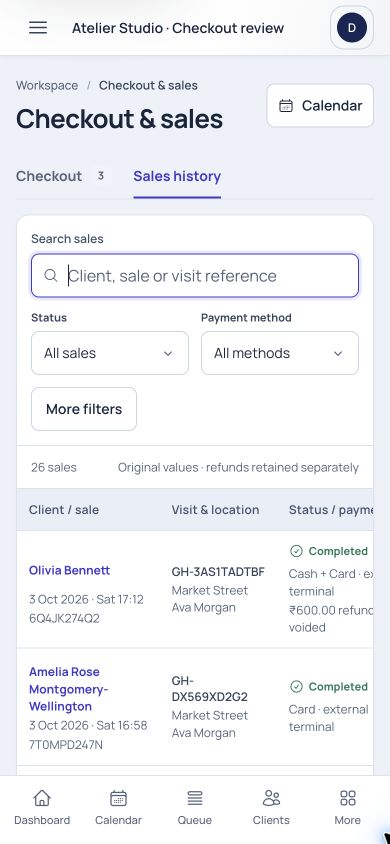
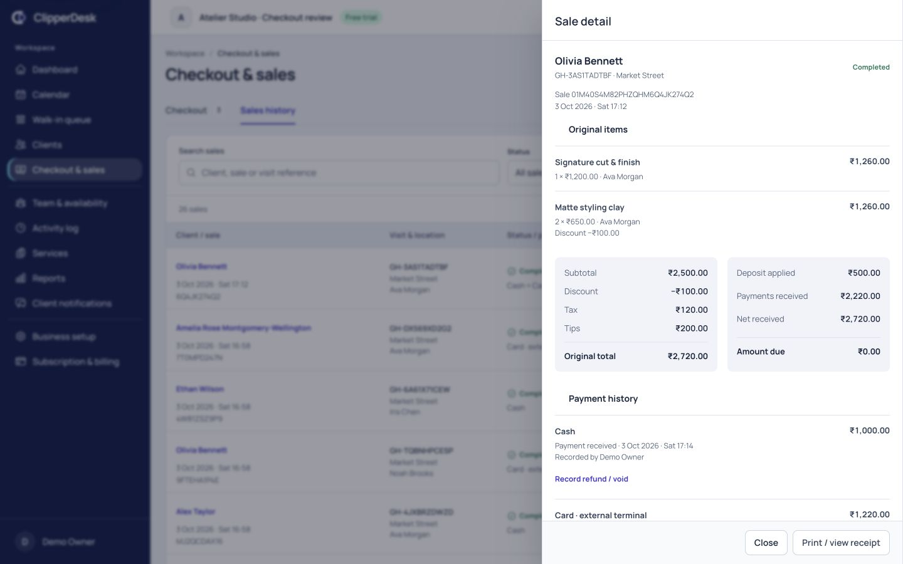
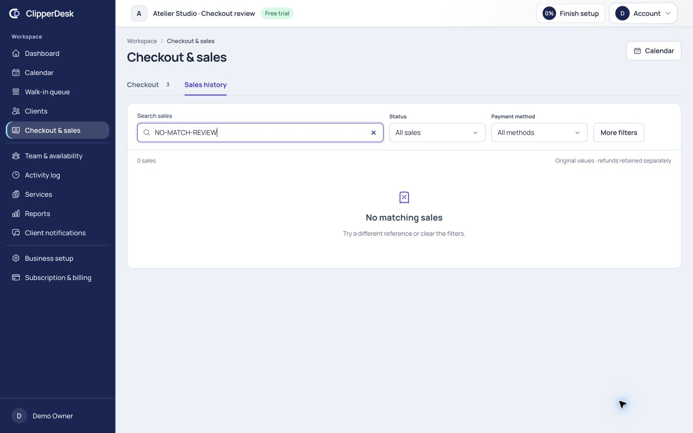

### 6. Review a refund/return and retain the audit trail — healthy within manual recording scope

The synthetic ₹600 cash refund was allocated to one clay product, reasoned and
restocked once. Net received became ₹2,120 including the deposit; the sale remained
completed, with a clearly labelled ₹600 recorded ledger adjustment. The original
issued receipt remains unchanged. The final review below shows only ₹400 remaining
on that original cash tender; it was cancelled without another record. Provider
payments requiring actual refund execution remain blocked.

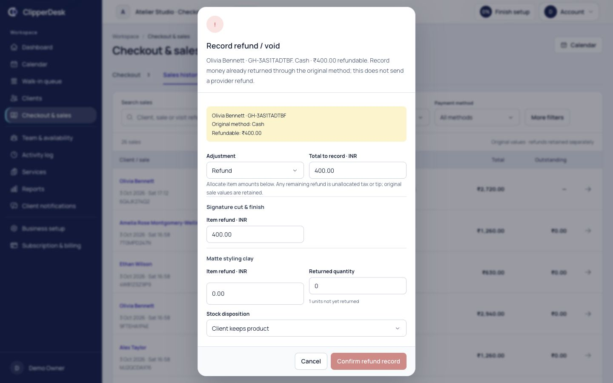
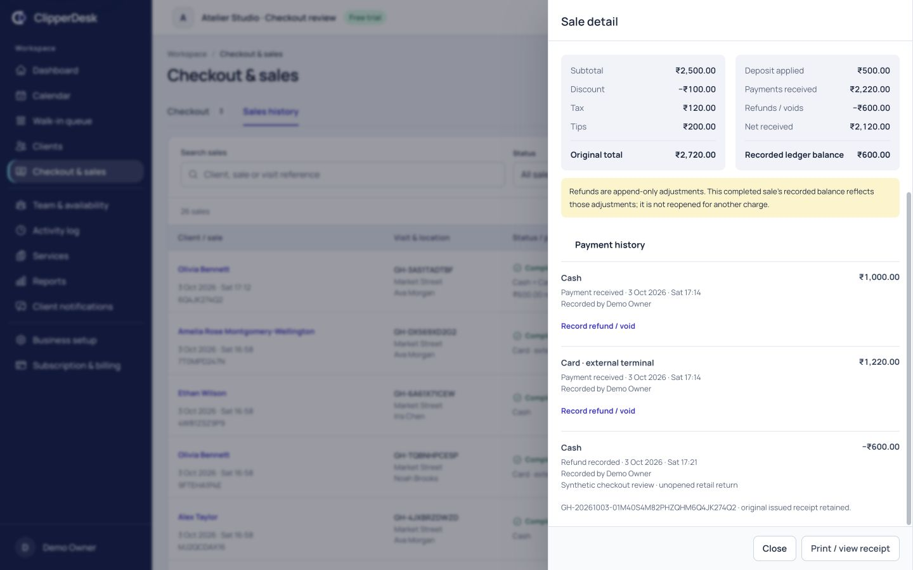

### 7. Use checkout on phone, tablet and laptop — healthy at sampled sizes

Measured CSS widths 320, 390, 768, 1024 and 1440 had no sampled document overflow.
Long client and product names wrap; amounts stay aligned with tabular digits.
Tablet/laptop review used a ten-item unsaved basket, including a long retail name,
while the due header stayed visible during scrolling. Phone due and Payment
shortcut remain available without a long return trip through the item list.
Labels, explicit statuses, focus styling and shared dialog/select keyboard behavior
were inspected. Escape/focus restoration and service editing were exercised;
screen-reader, 200% text, physical touch-keyboard and cross-browser testing remain.

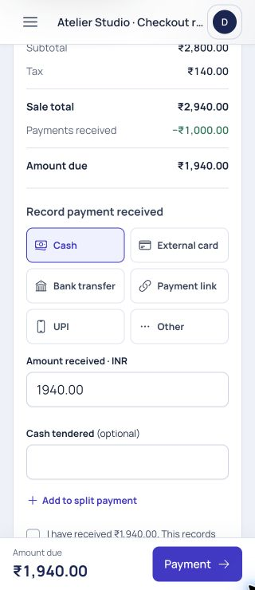
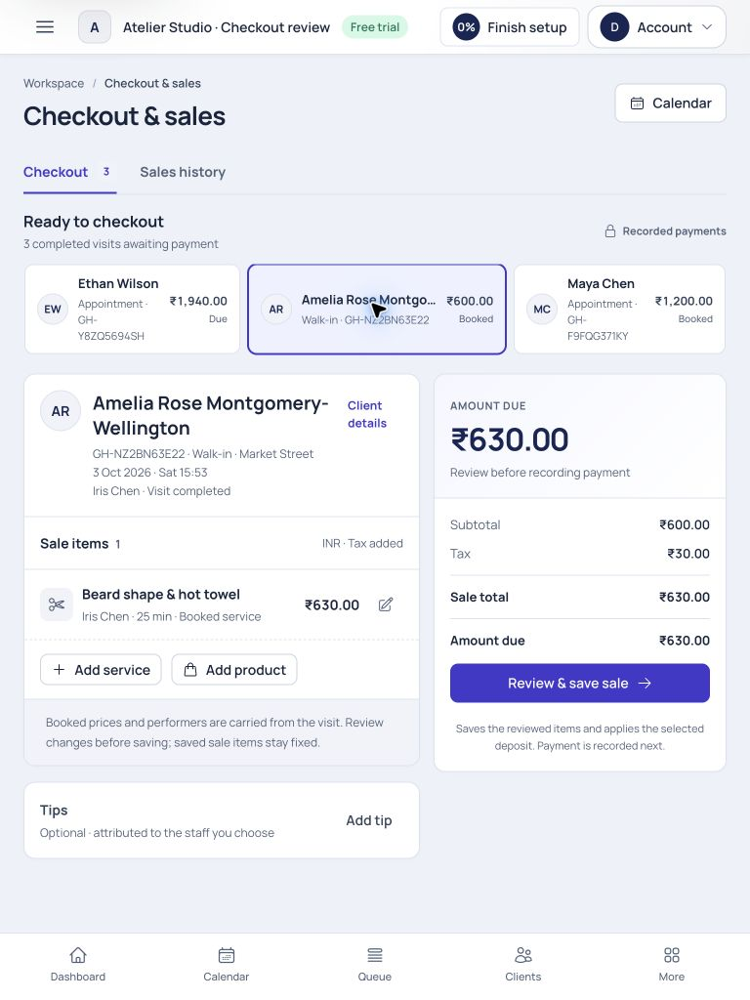
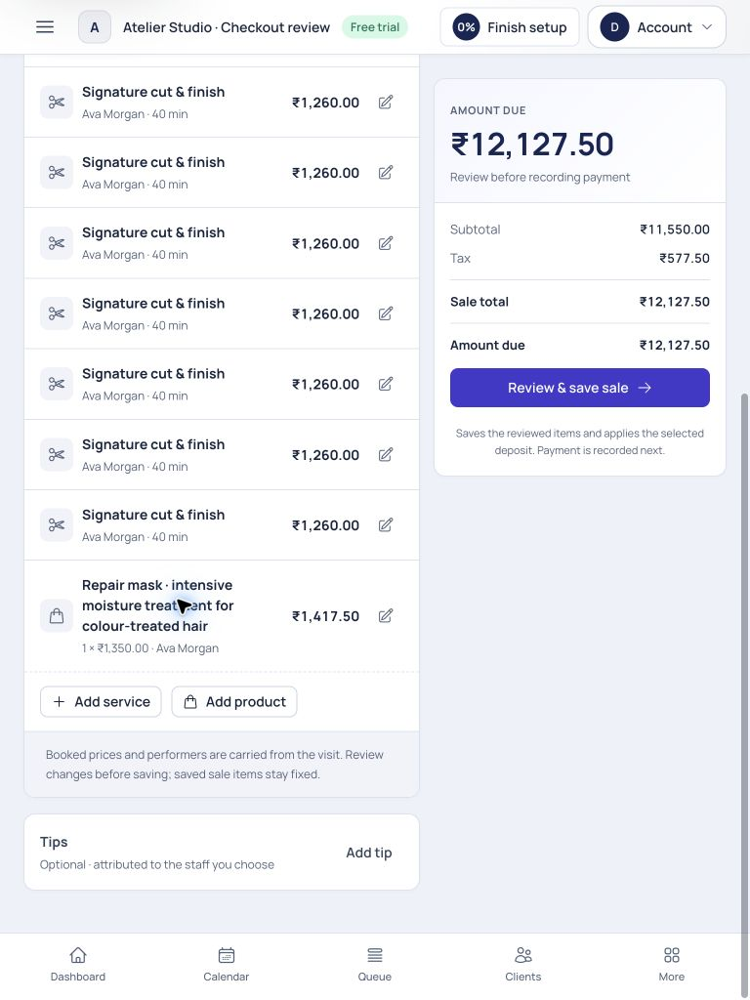
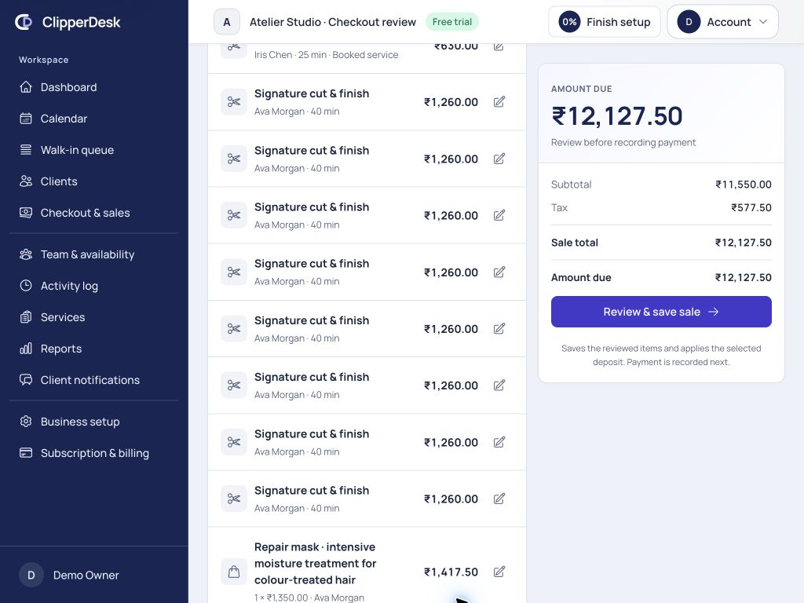

### 8. Leave unsaved work or recover an uncertain command — guarded

Switching an edited visit opens a compact discard review and states that no payment
was recorded. Browser review exercised this guard and discarded the long basket
and the final service edit. Pending payment/refund payloads retain their exact
key and values per user/business/sale, freeze changes and offer retry/ledger refresh.
Persistence helpers and server replay are tested; a real network drop after commit,
terminal failure and production database concurrency were not browser-simulated.

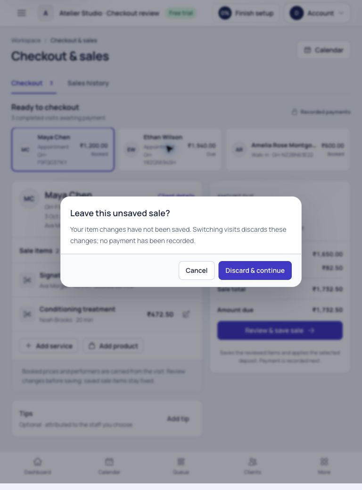

## Five-perspective final review

| Perspective | Result and remaining boundary |
| --- | --- |
| Receptionist | Client/visit and due lead; booked services preload. Common completion follows review/save then received-payment confirmation. Service/product search and split staging stay on the page. No measured three-second usability or click-time study is claimed. |
| Owner | Server prices, discount authority, verified deposits, atomic recording, stock/commission settlement and actor/reason trails protect revenue. Net receipts/refunds remain distinguishable from original totals. Live provider certification is still required. |
| Staff | Performer names are explicit; current qualified additions and staff tips are supported. One service still has one primary performer. Post-save attribution transfer needs the OPEN-18 product/finance contract. |
| Product designer | Compact context, restrained surfaces, right-aligned money, visible due, progressively disclosed controls and responsive payment navigation give the flow a clear hierarchy. Long-list, empty, completed and refund states were visually inspected. Independent usability/accessibility review remains. |
| Engineer | Dedicated basket/query services, existing integer calculator, aggregate locks, bound idempotency, allowlisted responses and append-only history keep the modular monolith intact. Tests cover tenant/location/role isolation and transactional failure. Production race/load evidence remains a release gate. |

## Verification and limits

- Full PHP suite: **384 passed / 4,422 assertions**; 28 existing intentional skips.
  CheckoutWorkspaceTest adds 14 feature tests covering qualified source pricing,
  stale quote refusal, authority/redaction, verified deposits, zero/full-prepaid
  completion, exact partial/split replay, stock rollback, history/date filters,
  receipts, manual returns and provider-refund refusal.
- All **34 frontend helper tests pass**, including precise zero/two/three-decimal
  currency entry and pending-command persistence. Client/SSR production builds,
  all 17 front-site asset budgets, scoped PHP formatting and whitespace checks pass.
- No migration or dependency added. Local fixtures can be seeded with
  `php artisan db:seed --class=CheckoutWorkspaceReviewSeeder` in local/testing only.
- Existing approved tax/commission calculations are preserved. Currency rendering
  is tested; multi-currency tender conversion and jurisdiction certification are
  not supported by this UI.
- OPEN-13/16 live provider capture/refund/deposit completion remain unresolved.
  Phase 2 memberships/packages/gift cards/wallets/coupons, standalone retail sale
  creation and multi-performer service attribution were not promoted.
- OPEN-18 saved-sale amendment/cancellation and controlled allocation-transfer UI
  remain pending an explicit compensating financial/inventory/commission contract.
  Saved stock drift therefore requires authorized stock correction/support review.
- Role/location restrictions are HTTP-tested; browser visuals used the owner.
  Device printers, real scanners/terminals, message delivery, all role visuals,
  cross-browser/accessibility certification, live providers and production
  concurrency/load were not verified.
- `01-before.jpg` is baseline evidence. `05-split.jpg` is a rejected intermediate
  layout, superseded by `08-split-final.jpg`. `13-refund.jpg` records the initial
  synthetic return review; `22-refund-context.jpg` shows the refined final header.
  The earlier completed-state image retains financial evidence; its receipt link
  alignment was subsequently corrected. Other saved captures are supplementary.

