# Clients operational CRM review — 2026-10-03

Implemented against FR-11/12 with existing FR-06/08 scheduling, FR-13 commerce
and FR-15 communications. ADR-046 records the scope. The client-records module
specification was restored before behavior changed; the other OPEN-14 module
restoration work remains separate.

## Implementation audit

| Area | Existing source and resulting behavior |
| --- | --- |
| Canonical identity | Business-owned `Client`, normalized name/mobile/email, encrypted preferences, versions and tags. Manual creation and Calendar/Queue retain the same identity. Exact matches reuse; shared contacts require review. |
| Appointment history | Appointment → service lines → segments → performers/location. Completed visits, cancellations and no-shows use all authorized appointments, independently of 20-row history pages. Upcoming uses live statuses; recent excludes future bookings. |
| Services | Immutable booked names/prices and performer evidence remain historical. Saved preferred services/staff are explicit; top completed services are separately labelled patterns. |
| Money | Client-linked `Sale`, applied deposits and append-only `PaymentTransaction`. Net receipts = completed paid + applied deposit − refunded. Positive open balances and completed visits without completed checkout are distinct. Totals remain separate per currency; appointment quotes are not spend. |
| Benefits | No approved implemented client membership, package, gift-card, wallet or loyalty aggregate. Platform Membership means staff access; Business subscription means SaaS billing. No placeholder benefits UI added. |
| Notes/context | Encrypted kind/content, visibility, importance and author/time. Staff name falls back to the same-business note-creation audit actor; unknown historical authors remain labelled unknown. Sensitive content and file metadata are permissioned; sensitive reads stay audited. |
| Supporting records | Existing immutable form versions/requests, consent evidence, private attachments, privacy cases and reasoned/versioned merge remain accessible in Client records. No new destructive command. |
| Communications | Existing client-linked delivery intents/outcomes, latest 30, only with contact permission. Preferences do not grant marketing consent. This work adds no sending action. |
| Roles | Client view/manage, contact, sensitive, notes, forms, files, privacy, merge, Calendar all/own, assigned locations, checkout and revenue permissions govern server payloads/actions. Contact-hidden updates retain stored contacts. Finance-hidden bookmarks return Overview. |
| Reporting/navigation | Existing governed reporting/sales services remain unchanged. Clients stays between Queue and Checkout, with the shared icon and clear active state. A real pending-duplicate review may appear only for authorized merge users; no decorative navigation badge. |

## Findings addressed

- The old default profile exposed an edit form and supporting administration before
  operational context. Overview now answers who, next visit, important notes,
  preferences, recent history and payment follow-up; edits move to a drawer.
- Name search could match every phone through an empty normalized wildcard. Name,
  phone, email and public reference now have independent guarded predicates.
- Placeholder financial summaries and bounded-list counts were unsuitable for CRM
  totals. Exact aggregates and authorized ledger projections replace them.
- Raw appointment paginator serialization could disclose saved contact snapshots.
  History now uses an explicit allowlist; paginator metadata contains no raw data.
- Hidden contacts must survive profile edits, and clearing authorized contacts must
  also clear normalized keys. Both paths are regression-tested.
- Duplicate creation now offers existing profiles and requires explicit shared-contact
  acknowledgement, with a server recheck. Merge preview uses the actual survivor
  parameter and displays what will be retained, filled and moved.
- Browser review caught an owner-note attribution error, an unsaved-navigation guard
  intercepting the profile's own save, a phone history overflow caused by absolute
  accessibility text, a wrapping Add tag button, and a shared select observing an
  already-unmounted node. These were corrected before final verification.

## Flow review

Screenshots are exact Chrome captures, saved and visually inspected. Contacts are
synthetic. `ClientWorkspaceReviewSeeder` runs only locally/testing, in the separate
Atelier Studio review business: 36 clients, three professionals, three services,
long/duplicate names, sparse profiles, 25 completed visits for Olivia, ledger rows,
important notes, preferences and open checkout. Browser QA created one additional
synthetic client and saved its note/preferences. No provider payment or message was
sent. Full-page captures show fixed navigation at the original viewport position;
that is capture behavior, not a duplicate navigation element.

### 1. Directory, navigation, search and filters — healthy

Compact aligned identity rows, restrained metadata and a single profile target.
The two Alex Taylors remain distinguishable by contact. Debounced server search,
clear controls, relationship/staff filters, sorting, loading/error feedback and
pagination avoid loading all clients. Query count stays constant from one to 30
clients. Desktop rows use 64px minimum height; phone rows disclose next/last context.

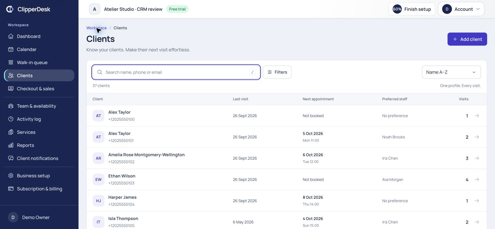

### 2. Add client and duplicate review — healthy

Name/contact essentials lead, optional referral follows. Lookup is cancellable;
possible matches have inspectable links and shared-contact confirmation. Server
validation remains authoritative. Browser creation opened the new profile with a
success message and honest empty states. Required controls receive focus; first/
last Tab loop, Escape and opener focus restoration were verified.

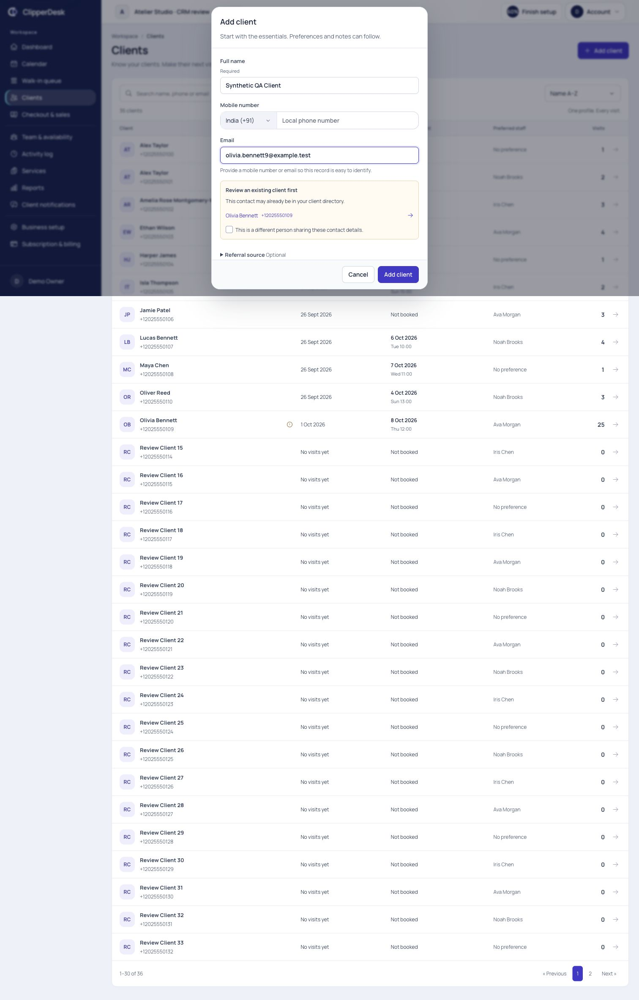
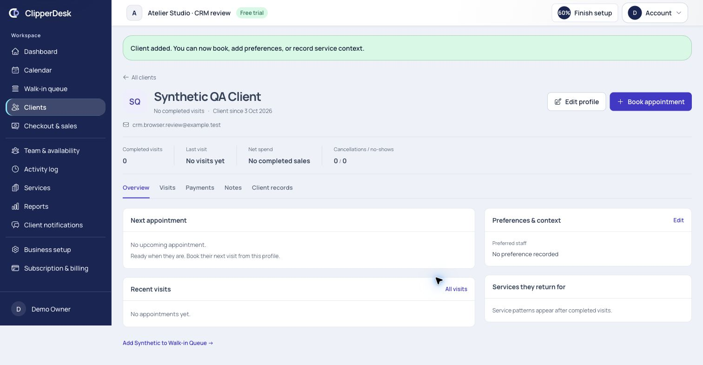

### 3. Profile overview and editing — healthy

Contact links, completed visits, last visit, finance-permitted net spend and
cancellation/no-show counts provide context. Next booking has services, staff,
branch/time zone, reference and an exact Calendar link. Important notes appear
beside it. Preferences and service patterns are distinct. The edit drawer preserves
phone control, tags, service/staff/contact preferences, version and reason. A
synthetic preference update succeeded; own save no longer invokes the navigation
warning. Unsaved departure/discard still requires review.

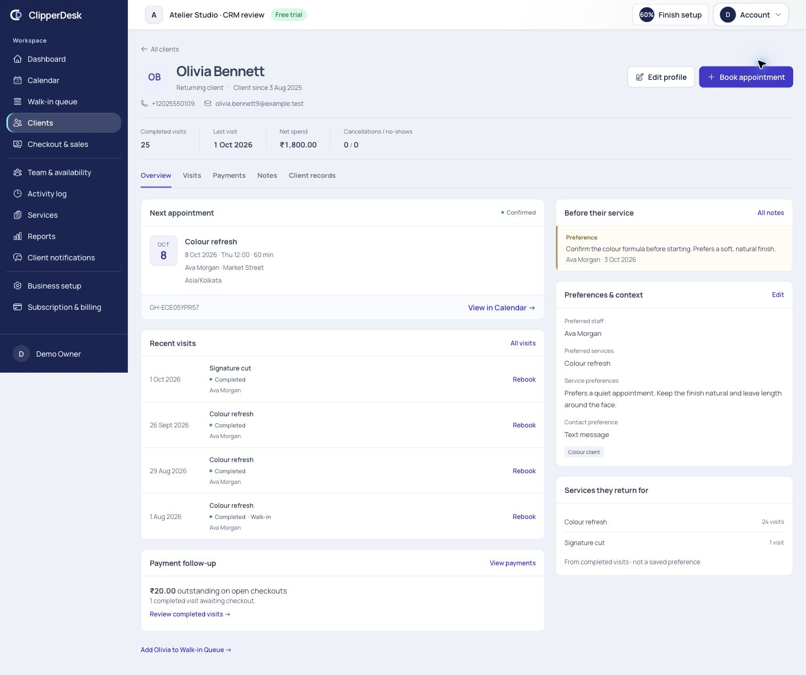
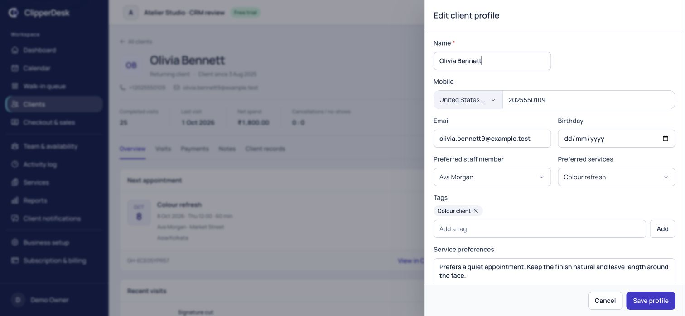

### 4. Visit and service history — healthy

All authorized history is paginated separately from exact metrics, with services,
performers, date/time zone, duration, source, status, permitted quote and useful
Calendar/rebook/checkout links. Converted walk-ins count once as appointments;
unconverted queue activity is separately labelled. Older pages keep the section.
Phone table overflow stays within its own scroll container.

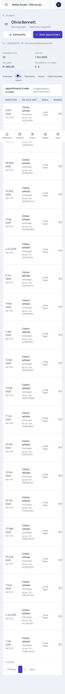

### 5. Payments and outstanding work — healthy

Compact totals explain net receipts, average completed sale, open balances,
refunds/tips and pending checkout. Transaction rows retain type/method/status and
currency, without provider evidence. Browser paging from rows 1–20 to 21–24 kept
Payments selected and totals unchanged. HTTP tests cover separate currencies and
refund history. No live financial transaction was executed.

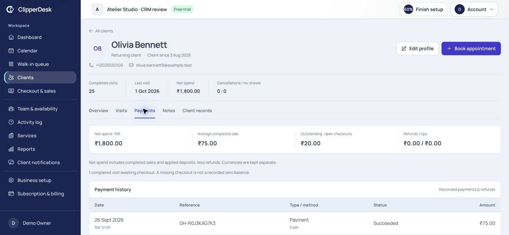

### 6. Notes, forms, files, consent, privacy and communications — healthy within verified scope

Notes have visible importance, author and time. Browser add saved a synthetic
important note with Demo Owner attribution. Client records keeps administrative
work off the default overview, with grouped supporting tools and explicit empty
states. File controls remain native/accessibly labelled with a styled chooser;
empty uploads and repeat submission are disabled. Existing CRM/consent tests cover
form versioning, files, privacy, consent and reviewed merge preservation. Browser
review inspected these controls; it did not send forms, upload files, execute a
merge or process a privacy case.

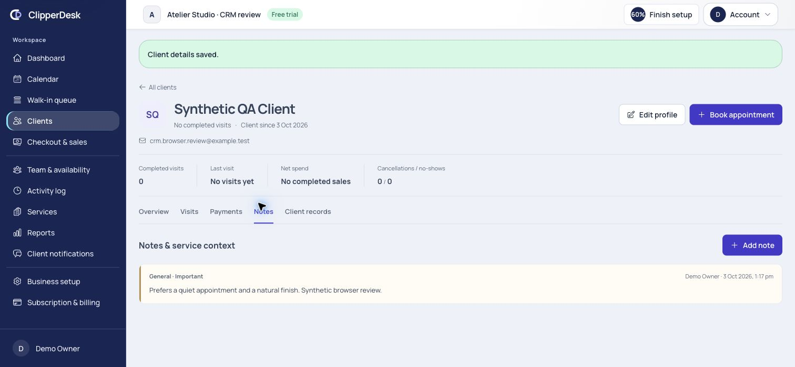
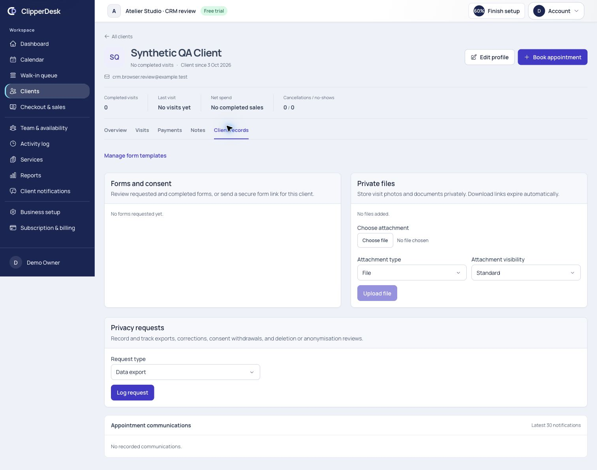

### 7. Calendar, rebook and Walk-in Queue handoffs — healthy

Both handoffs resolve an active authorized canonical client on the server. Rebook
opens the creation drawer with prior eligible service/staff, current catalogue and
availability review. Tests cover inactive service exclusion and unavailable staff
requiring selection. Normal booking uses eligible saved preferences. Exact Calendar
links use the original branch-local date. Queue opens with existing client selected
and saved contacts; requested service and staffing remain reviewable. No booking
or queue entry was submitted from these review drawers.

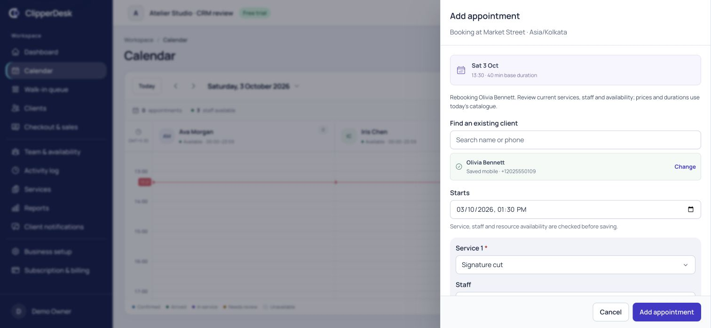
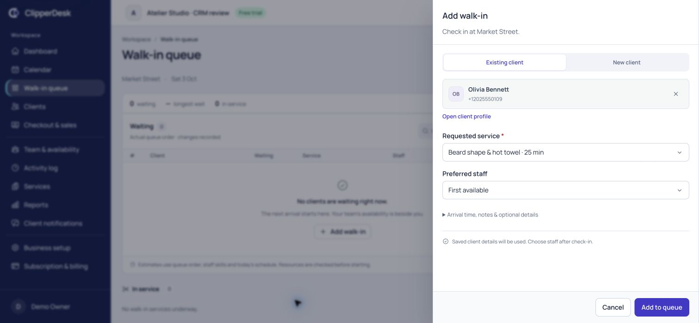

### 8. Responsive and keyboard behavior — healthy at sampled sizes

Measured directory/profile widths: 320, 390, 768, 1024 and 1440 CSS pixels without
sampled document overflow. Phone Visits and Payments were separately checked at
390 after the scroll-boundary fix. Phone Overview prioritizes next appointment,
important notes and preferences. Tablet preserves the two-column overview.
Profile tabs support arrows/Home/End; browser ArrowRight selected Visits. Shared
select mount cleanup prevents observing a detached node during fast navigation.

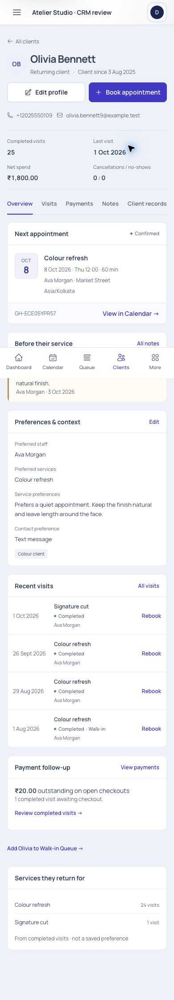
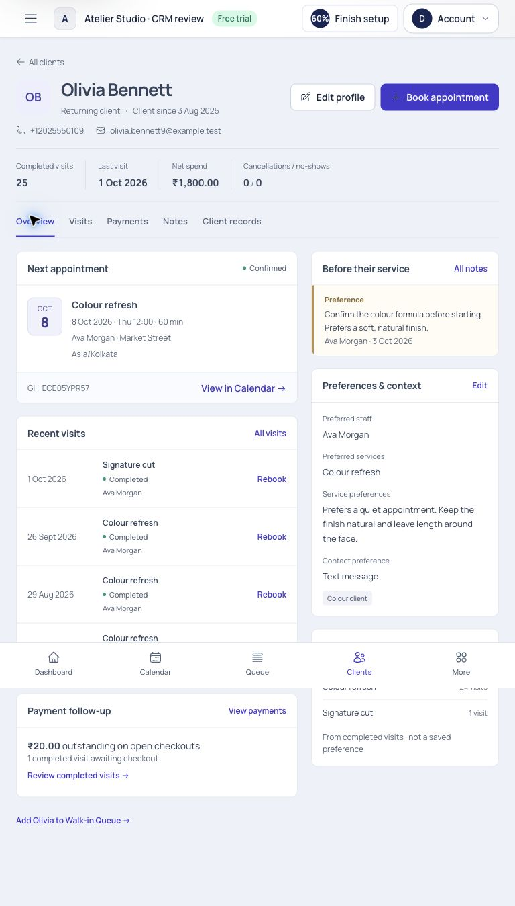
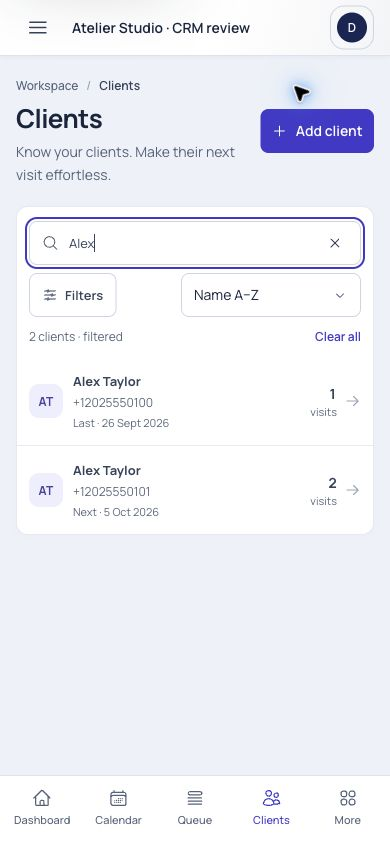

## Verification

- Full repository suite: **370 passed, 4,246 assertions, 28 existing intentional
  skips**, 30.20 seconds. New ClientWorkspace tests: 12 scenarios covering identity,
  scopes/redaction, filters, exact totals, pagination, ledger, duplicate review,
  contact clearing, owner authorship, rebook validity and constant query growth.
- All frontend helper tests: **30 passed**, including four new CRM tests for UTC SQL
  timestamps, midnight/DST, zero/two/three-decimal currencies and Unicode initials.
- Production client and SSR builds passed under installed Node 24.19.0. Front-site
  asset budgets passed for all 17 route entries. Targeted PHP formatting and
  repository whitespace checks passed. No new migration or dependency needed.
- Browser owner review verified search, duplicate warning, synthetic creation,
  note and preference save, payment pagination, dialogs, tabs, responsive geometry
  and Calendar/Queue prefills. Role/location/privacy checks are HTTP-test evidence,
  not screenshots of every role.

## Practical limits and remaining separate work

This is local browser/test evidence, not independent WCAG certification,
production load/latency evidence, provider certification or the entire browser
matrix. No approved benefits aggregate was invented. Existing notes, forms,
consents, file and privacy lists retain their prior loading strategy; the high-volume
appointment and transaction histories are paginated, notifications/queue snapshots
bounded. A later records-volume pass can paginate those supporting lists with
appropriate evidence. Recorded communication outcomes do not prove provider
readiness. Existing retention, malware-scanning, regionalisation and launch gates
remain as recorded in project status and decisions.

Baseline/early screenshots `02-before-profile.jpg` and `03-overview-desktop.jpg`
record the original default edit presentation and initial sparse-client overview;
the populated/final evidence above takes precedence.
