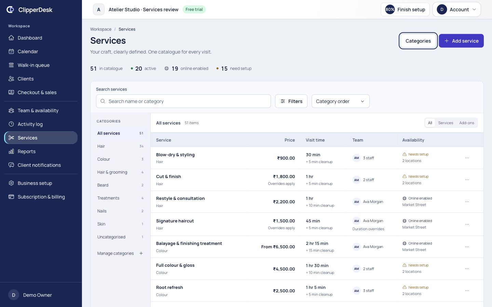
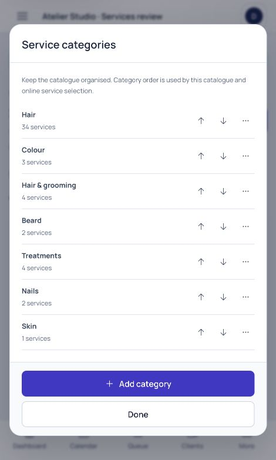
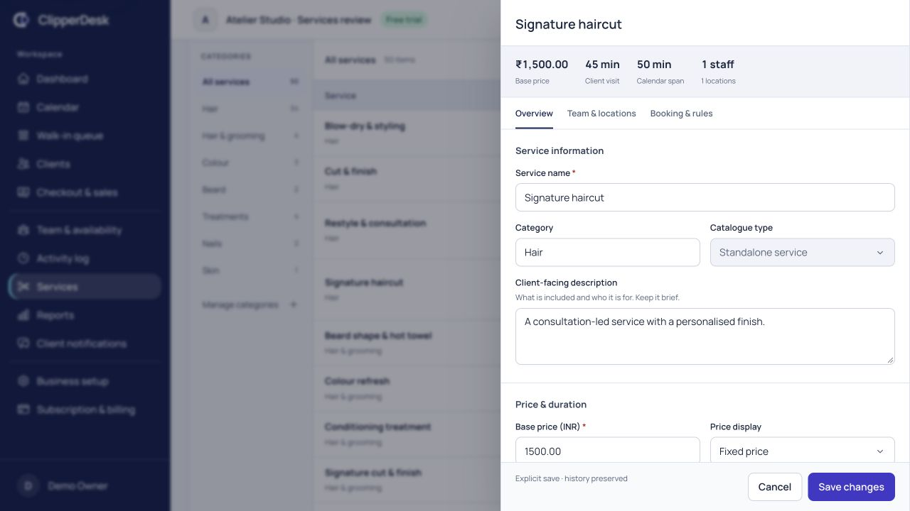
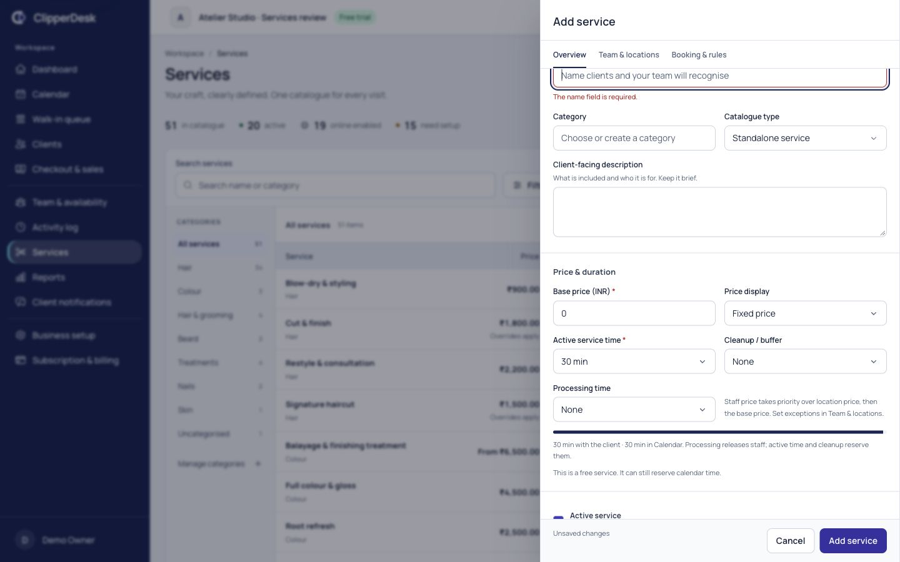
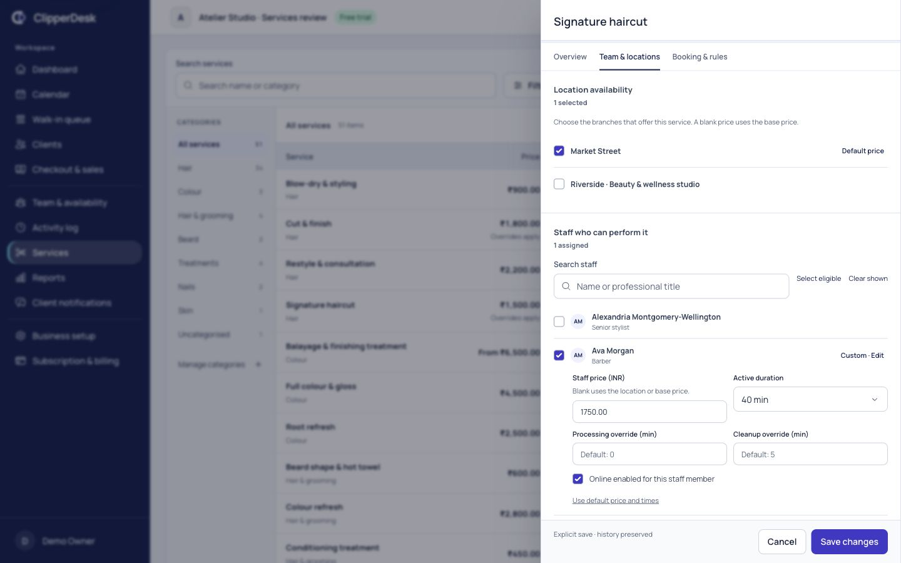
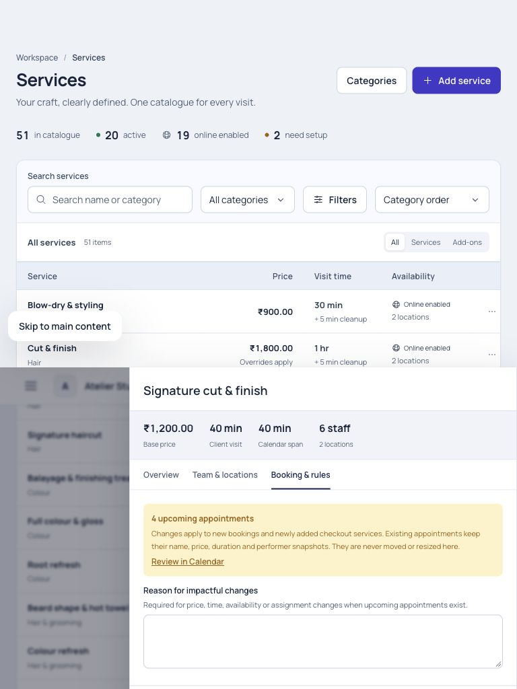
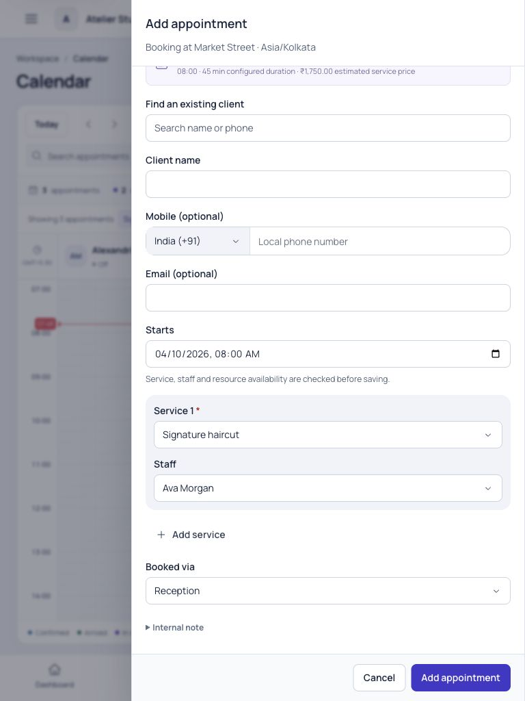
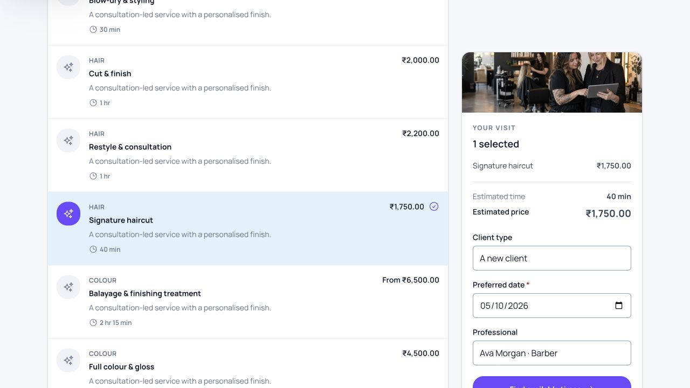
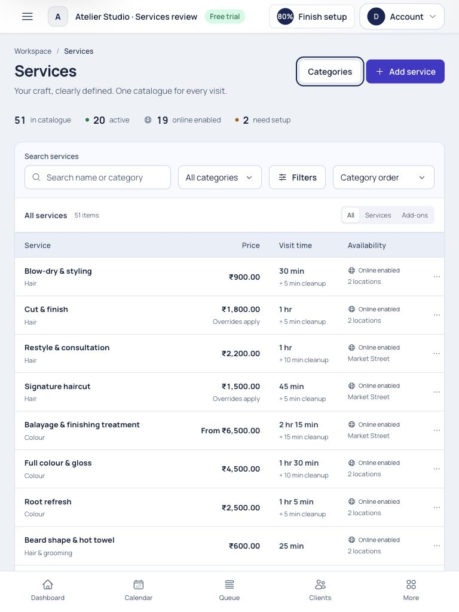

# Services — implementation and product review

Reviewed 2026-10-03–04. Local ClipperDesk application. Specification:
[Services](../../modules/services.md). Scope: [PRD](../../product-requirements.md),
[ADR-049 and OPEN-19/20](../../decisions.md).

The Services area now provides one salon catalogue with focused configuration,
clear price/time inheritance and explicit review before consequential saves.
Existing operational engines retain responsibility for booking fit and financial
history. The redesign includes backend integrity and consumer projections.

## Evidence context

Original Services catalogue/editor were inspected and captured before changes
([01](01-before-catalog.jpg), [02](02-before-editor.jpg)). Subsequent review used
`ServiceCatalogReviewSeeder`, guarded to a testing-only isolated SQLite database.
The synthetic Atelier Studio fixture has two branches, six professionals,
50 services/add-ons, long names, exceptions and incomplete configurations.
A free Review consultation was created through the browser, bringing the total
used for pagination to 51. Colour was reordered through category management.
A safe exact save retry was confirmed; validation drafts and duplicate previews
were discarded. No real appointment, payment, invitation or access grant was made.

Sampled CSS widths: 320, 360, 390, 768, 1024, 1280 and 1440. DOM measurements
show no sampled document overflow; narrow drawer client/scroll widths matched
318/318 at 320 and 358/358 at 360. Tablet price widths were refined to prevent
starting-from amounts overlapping visit time. Phone summaries use two columns.
Screenshots were saved and visually inspected. Clips must account for document
scroll positions: files explicitly named rejected are excluded from evidence.
The 19 phone capture is a detail of visible fields/save controls; 10 supplies
full narrow drawer context. 18 is the final catalogue with branch coverage checks;
03/11/12 precede that additional warning. Synthetic setup counts are not analytics.

## Existing implementation and capability audit

| Concern | Source and supported boundary |
| --- | --- |
| Navigation/design | AppLayout and shared PageHeader, SearchField, AppButton, AppSelect, FormField and AppDialog retained. Scissors icon identifies Services; one entry includes categories/add-ons. |
| Identity/categories | Service and ServiceCategory business identities remain stable. Case-insensitive unique names, category create/rename/archive/order, active-child archive protection. No delete/merge. |
| Pricing | Base fixed/starting-from, ServiceLocation price and versioned StaffServiceAssignment price. Staff > branch > base; blank inherits, zero is real. Recorded currency preserved. No named length/colour or location-duration variant model. |
| Timing | EffectiveServiceResolver and ServiceSegment active/processing/cleanup totals, staff occupancy and ServiceResourceRequirement. Existing layout/resource links preserved; missing staff override segments now resolved correctly. |
| Staff/locations | Qualifications, effective intervals, work branches and active/bookable status remain canonical. Inactive configured references can be retained without restoring bookability. Full configured branch scope is checked server-side. |
| Online/client rules | Service online preference, business online posture, staff online variants, notice/advance windows, client eligibility and consultation source rules retained. Completed-consultation prerequisites are undefined under OPEN-20. |
| Deposits | Existing none/inherit-business, fixed/percentage and booking eligibility rules reused. Public paid confirmation remains incomplete under OPEN-16; no pretend payment control. |
| Tax | CommerceSetting rate and inclusive/exclusive behavior remain authoritative. Service tax category is descriptive metadata, not a per-service exemption engine. |
| Add-ons | ServiceAddon attachment, qualification, timing and resource fit supported. Calendar/public parent selection and newly added checkout parent checks enforce attachment. Historical booked lines preserved. |
| Images/benefits | Existing image references retained. No operational upload workflow. Memberships/packages/wallets/prepaid benefits remain Phase 2; no misleading controls. |
| Discounts/commissions | Permissioned Checkout adjustments and existing commission-rule/ledger owners reused. Existing assignment commission references preserved; not repurposed as a new editor. |
| Imports | Existing Business setup preview/errors/duplicate review/counts/export reused. Service CSV creates internal rows requiring setup; existing-service updates must use reviewed Services commands. No existing catalogue export/bulk mutation workflow was invented. |
| APIs/audit | Store/update/status plus category save/order routes delegate to scoped validation and ServiceCatalogManager. UUID payload replay, revisions, locks, upcoming signatures and hold checks are transactional. Activity presents useful price/time/count summaries. |
| Consumer history/reports | Calendar/Queue/Checkout use canonical current resolution for new work. Appointment/sale names/prices/times and append-only financial records stay recorded. Category order changes current grouping, not historical finance. |

## Numbered flow review

| Step | Flow | Health | Evidence and findings |
| --- | --- | --- | --- |
| 1 | Navigation, catalogue and finding a service | Pass | [18](18-desktop-final.jpg): compact category rail, aligned price/visit/team/branch columns, status distinctions, combined search/filters/type/sort. Browser pagination confirmed 26–50 of 51 on page two. Missing branch coverage is a setup warning, not a claim of instant availability. |
| 2 | Categories and secondary actions | Pass | [07](07-categories.jpg): inline category editing and explicit accessible move controls. Colour moved before Hair & grooming. Duplicate preview opens an inactive internal copy; cancelled in browser. Identity/resource-copy and history protection are feature-tested. |
| 3 | Create/edit, pricing, timing and validation | Pass | [04](04-after-editor.jpg), [20](20-validation-final.jpg): three focused sections and explicit save. Server validation preserves the draft, shows linked errors and focuses svc-name with aria-invalid=true after response. Free creation remains valid and Needs setup. Dirty close opens Keep editing/Discard changes; own save no longer triggers the dirty guard. |
| 4 | Professionals, branches and exceptions | Pass | [21](21-staff-overrides-final.jpg): searchable qualification with disclosed price/time/online exceptions. Selected Ava has ₹1,750 and 40 active minutes; blanks inherit. Existing resource/commission configuration remains visible/preserved. Automated tests cover inactive references, branch scope and stale variants. |
| 5 | Booking rules, impact and operational handoffs | Pass within supported scope | [13](13-booking-impact.jpg), [14](14-calendar-effective-price.jpg), [15](15-public-override.jpg): exact upcoming count, required reason for impactful changes and correct Calendar link. Calendar Ava selection shows 45 minutes including cleanup and ₹1,750; public summary shows 40 client minutes and ₹1,750. Parent deselection and branch switching prune invalid public selections. Final public reload excludes unqualified Classic manicure. Queue/Checkout integration is automated/source-reviewed; no new booking/payment was submitted. |
| 6 | Responsive controls and accessibility | Pass in sampled review | [10](10-narrow-editor-final.jpg), [12](12-tablet-final.jpg), [19](19-phone-editor-final.jpg): phone single-column fields and two-column summary, sticky save, long-name wrapping and compact category selector. Tablet retains separate price/visit columns. Labels, visible focus, native dialog trapping/Escape and non-drag ordering reuse shared accessible controls. Independent WCAG/all-device certification is not claimed. |

### 1. Final catalogue

### 2. Category management

### 3. Explicit editing and server validation

### 4. Staff exceptions

### 5. Operational configuration and shared estimates

### 6. Narrow and tablet layouts

## Meaningful issues corrected during review

- Staff processing/cleanup overrides previously failed to introduce missing
  canonical segment kinds. The resolver now supplies them in the correct order,
  including staff release semantics, while preserving existing resource identities.
- Aggregate timing saves retain segment IDs and layout instead of replacing
  resource-linked records; zero overrides remove zero-time effective segments.
- Unreviewed CSV updates could overwrite price or restore status. Existing service
  changes now require reviewed catalogue commands; imports validate old previews.
- Editing could omit inactive branch/staff references. They remain visible and
  retained, while new assignments must satisfy active scope/qualification rules.
- Whole configuration revision and exact upcoming appointment signatures prevent
  stale consequence reviews. Holds and dated future configuration block unsafe edits.
- The browser dirty guard intercepted its own save; a submission flag now admits
  the save while protecting navigation and keeping unconfirmed requests replayable.
- Calendar/public estimates now use qualified staff/branch exceptions; public
  branch switching and parent deselection remove hidden invalid selections.
- Added checkout add-ons must retain a supported parent; no change rewrites booked
  historical service lines. New Calendar lines default to an eligible standalone.
- Tablet From-price overlap and phone summary wrapping were corrected using
  explicit column widths and a two-column narrow summary.

## Final five-perspective product review

| Perspective | Result and implemented refinements |
| --- | --- |
| Salon owner setting up the catalogue | Search/category organization and minimal creation make setup direct. Incomplete active/free services can be saved with actionable warnings. Advanced settings are disclosed in two additional sections; no invented package/image workflow distracts from approved setup. |
| Manager maintaining price and capability | Staff/branch inheritance, natural timing, active/internal distinctions and retained inactive references are explicit. Safe price changes bind a revision/upcoming review/reason, protect holds and keep historical snapshots. CSV bypass was removed. |
| Receptionist booking and assigning walk-ins | Configuration authorization remains manager-only. Calendar eligible selectors and price/duration projections match canonical resolution; Queue capability/resource checks remain shared. Online preference is distinguished from actual slot availability. Parent-linked add-ons are controlled. |
| Senior product designer | Refined compact rows, tabular currency, natural time, quiet health treatment and category rail support scanning. Phone/tablet field and price refinements preserve density. Error focus, dirty discard, sticky explicit save and accessible category moves provide confidence. Three sections are sufficient; nested form cards and decorative analytics were avoided. |
| Senior engineer | Tenant and full branch scope, authoritative validation, business-first locks, revisions, exact-payload replay, immutable snapshots, segment identities and bounded loading are covered. Consumer projections omit private staff data. Future variants and undefined tax/image/consultation workflows remain explicit decisions instead of invisible assumptions. |

## Automated verification and limits

- `php artisan test --compact`: **426 passed, 4,745 assertions, 28 existing skips**.
- Final `php artisan test --filter=ServiceCatalogTest`: **19 passed, 139 assertions**.
  Covers canonical precedence/snapshots, exact replay, status, stale impact, holds,
  dated assignments, validation/roles/tenant scope, category history, segment
  introduction/removal/resource identities, duplicate, Calendar/Checkout parents,
  import safeguards, Activity presentation, inactive references and public privacy.
- `node --test tests/Frontend/*.test.mjs`: **48 passed**, including seven catalogue
  tests for exact money, natural time, filters/order/channel, dated Calendar variants,
  parent add-ons and staff/branch/base estimate precedence including zero.
- Client and SSR production builds pass with the manifest-required Node runtime.
  Front-site budgets pass for **17 route entries**. Scoped PHP formatting and
  `git diff --check` pass. No dependency was introduced.
- Query growth from one to 41 services is bounded to at most two extra queries;
  no production latency/load claim is inferred. Browser review is an owner fixture;
  other role/tenant/branch protections are HTTP-tested, not a visual role matrix.
- A composite-business, uniquely keyed command replay migration was added and
  applied locally. Production MySQL race/load behavior, other browser engines,
  assistive technology and independent accessibility certification remain unverified.
- OPEN-19 protects future-effective edits; OPEN-20 records undefined service tax
  rules, image upload, consultation completion and advanced layout/resource commands.
  Membership/package instruments remain Phase 2. OPEN-16 paid-public confirmation
  and existing legal/provider/release gates remain in force.
