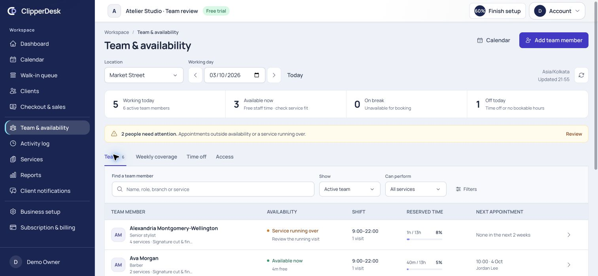
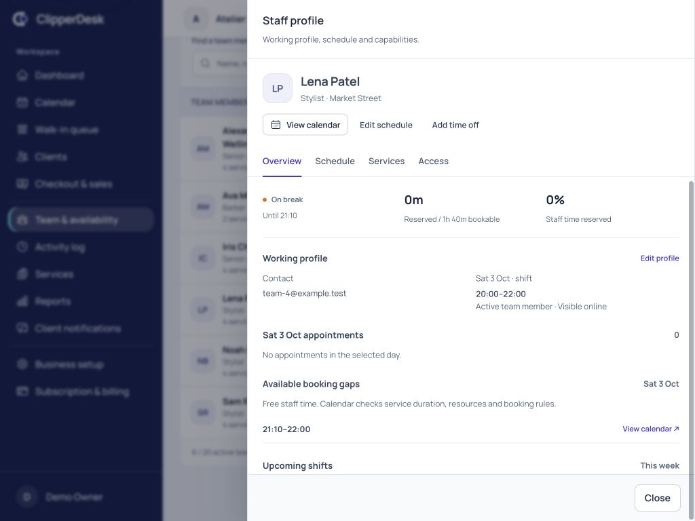
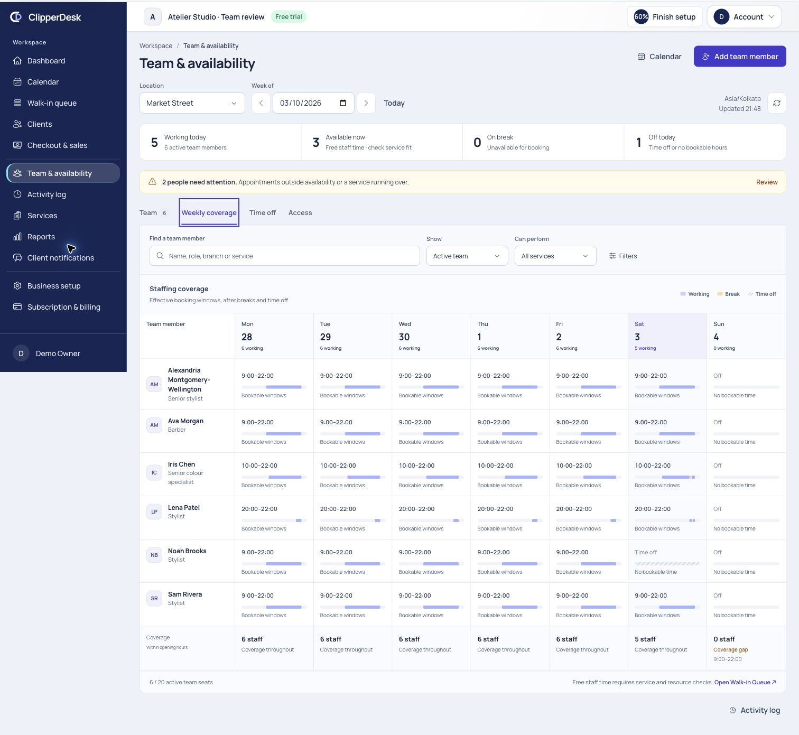
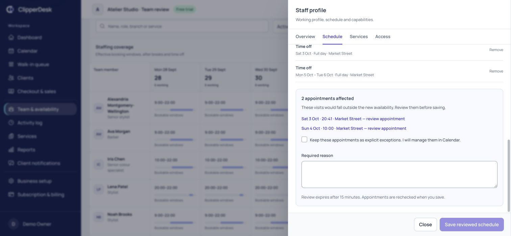
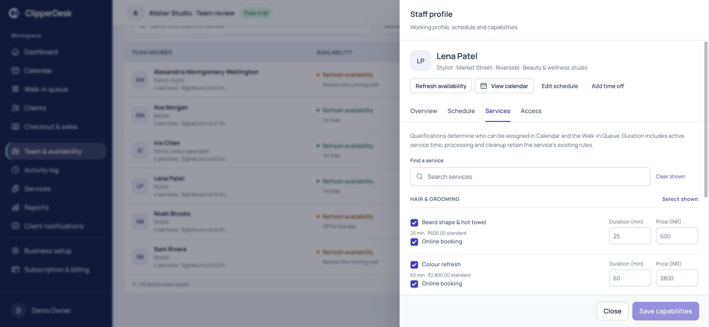
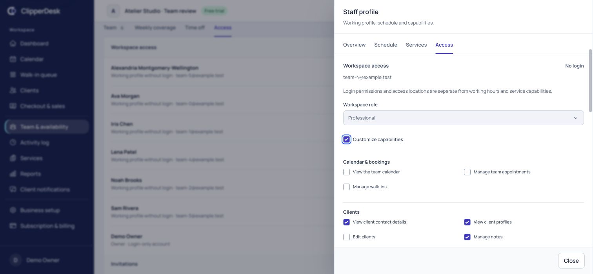
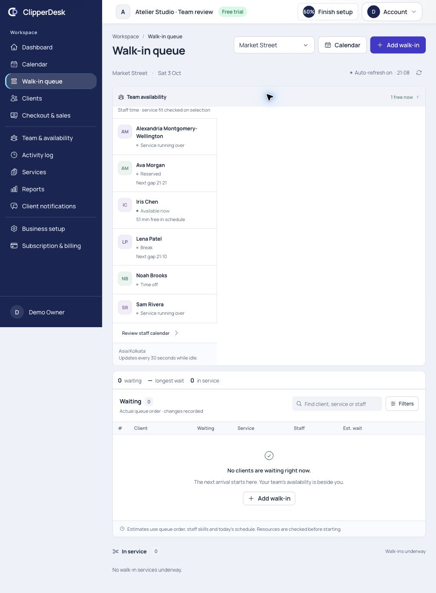

# Team & availability — implementation and product review

Date: 2026-10-03. Local ClipperDesk application, Chrome, existing signed-in demo
owner. Specification: [Team and availability](../../modules/team-availability.md).
Decision: [ADR-048 and OPEN-19](../../decisions.md).

The generic directory has become one operational workspace with Team, Weekly
coverage, Time off and manager-only Access. Profiles open beside the workforce
view. Availability is projected from the same Calendar configuration and capacity
records used by booking and the Walk-in Queue.

## Capture and verification context

The local/testing-only `TeamWorkspaceReviewSeeder` creates an isolated
“Atelier Studio · Team review” fixture with six staff, a deliberately long name,
two branches, four service capabilities, recurring hours, leave, breaks and
appointments. The browser review saved Lena's one-time break at Market Street
(3 Oct, 20:50–21:10) and added Riverside as a working branch. Calendar showed the
saved break; Queue showed Lena on break until 21:10. No appointment was moved,
no payment recorded, and no invitation or permission grant was submitted.
The conflicting Ava leave proposal was reviewed and discarded.

Live state changes as the clock advances: early screenshots show breaks and
reserved visits; later ones show free gaps and overdue in-service visits. These
are synthetic operational records, not performance claims about real people.

Reviewed widths: 320, 390, 768, 1024, 1366, 1440 and native 1512 pixels.
Final DOM measurements show no document overflow at 320/390/1366/1440; the
320-pixel drawer measures 318 pixels for both client and scroll width. Desktop
coverage scrolls locally on tablet; phone coverage becomes day-by-day lists.
The temporary viewport override was reset after review.

Screenshots were saved and inspected during this run. Native viewport captures
are strongest for desktop drawers. Emulated full-page captures can stitch fixed
navigation at an incorrect document offset or scale a native-window capture;
files explicitly marked `rejected` are not accepted evidence. Document-coordinate
phone drawer captures 26/41 were checked against the actual visible controls and
DOM geometry. No screenshots were generated or substituted for browser captures.

## Existing implementation audit

| Concern | Existing source and resulting boundary |
| --- | --- |
| People and accounts | `StaffProfile` is the working/bookable person; `User` and business `Membership` provide login access. Disabled login does not delete historical staff identity. |
| Roles | Business roles, permissions and membership locations remain authoritative. Starter roles are presets; titles are descriptive. Manager, reception and own-profile projections respect the existing permission names. |
| Branch hours | `Location`, weekly opening hours and `LocationScheduleException` supply branch-local opening windows and closures. Staff rules are checked against these windows with visible outside-hours warnings. |
| Staff scheduling | `StaffAvailabilityRule`/configuration and existing resolvers support regular hours, breaks, leave, personal blocks and temporary replacements. No separate shift or leave-approval data store was introduced. |
| Services | `StaffServiceAssignment` supports qualification, online visibility, duration and price variants. Catalog eligibility remains branch-aware and historical snapshots remain immutable. |
| Appointments and Queue | `CalendarWorkspaceQuery`, canonical reservations/segments, booking validation and `WalkInWorkspaceQuery` determine occupying time and service fit. The Team workspace consumes those projections. |
| Compensation | Existing commission/tip ledger and statement/export support are reused. There is no full HR/payroll administration UI or new salary field. |
| UI foundation | Existing AppLayout, PageHeader, AppButton, AppSelect, AppDialog, SearchField, PhoneInput and form fields retain the same typography, colors, focus and drawer behavior as redesigned operational areas. Team-specific timeline/density styles add workforce context. |
| APIs | Team adds scoped schedule preview/save, working-profile and capability update routes. Existing invitation, membership-access, commission statement, Calendar and Queue routes remain the operational handoffs. Legacy staff availability now delegates to the reviewed schedule contract. |

## Numbered flow review

| Step | Flow | Health | Accepted evidence and findings |
| --- | --- | --- | --- |
| 1 | Team navigation and workforce directory | Pass | [40](40-team-overview-final.jpg): clear combined navigation, compact summary, immediate search and scoped filters. Text distinguishes free staff time from service/resource fit. Attention links filter to exceptions. Long names wrap without widening mobile rows; no-match search provides Reset filters. |
| 2 | Staff operational profile | Pass | [18](18-tablet-profile.jpg), [36](36-profile-compensation-verified.jpg): compact identity/actions, current status, visits, booking gaps, four upcoming shift days and existing permissioned commissions. Work profile and login status remain separate. HTTP statement routing was repaired and browser empty-period output verified. |
| 3 | Weekly planning and coverage | Pass | [30](30-coverage-desktop-final.jpg), [16](16-tablet-coverage.jpg): aligned seven-day resource grid, sticky names, break/leave overlays, actual effective staff counts and explicit Sunday coverage gap. Phone DOM confirmed day lists. Figures describe measured windows; there are no speculative staffing recommendations. |
| 4 | Hours, breaks, leave and exact consequence review | Pass | [06](06-conflict-review.jpg), [08](08-break-save-verified.jpg), [26](26-phone-schedule-final.jpg), [41](41-narrow-controls-accepted.jpg), [39](39-time-off-final.jpg): weekly copy, split shifts, dated exceptions and recurring/one-time breaks. Impact names affected appointments, blocks active holds and requires an explicit reason for retained appointments. Phone times and weekday labels are readable after refinement. |
| 5 | Services, duration and staff price | Pass | [37](37-services-final.jpg): category search and select/clear shown, separate qualification/online/duration/price controls. Invalid money cannot silently round into a saved price. Historical variants and appointment price/duration snapshots are preserved. |
| 6 | Access and onboarding | Pass within authorized review | [33](33-access-accepted.jpg), [34](34-capabilities-final.jpg), [32](32-add-final.jpg): actual business roles, capability groups, independent access branches, login-only accounts, invitation status and minimal creation. Dirty-access close showed Keep editing/Discard changes. No invitation was sent; mutation/authorization paths are covered by automated tests. |
| 7 | Calendar, Queue and responsive handoffs | Pass | [20](20-calendar-integration.jpg), [22](22-queue-team-verified.jpg), [41](41-narrow-controls-accepted.jpg): saved break visible in Calendar and Queue, leave and running-over states agree, profile links preserve staff/branch/date. Queue fit/appointment assignment continue through canonical scheduling rules. Desktop, tablet and phone checks covered overflow, time controls and focused tasks. |

### 1. Team overview

### 2. Profile context

### 3. Coverage

### 4. Consequence review

### 5. Capabilities

### 6. Permissions

### 7. Shared Queue availability

## Resolved findings

- The original directory and large onboarding form ([01](01-before-directory.jpg),
  [02](02-before-add.jpg)) offered little daily workforce context. The combined
  workspace and focused profile replace those flows while retaining supported
  capabilities.
- Native mobile time fields clipped their AM/PM segment; day labels and Today
  wrapped in tight widths. Control widths, typography, non-wrapping day labels
  and fixed mobile table columns were refined. Final narrow evidence is 41.
- A branch selector inherited icon-button sizing. The selector now keeps its
  intended width/height, and multi-branch editing was checked.
- Exact schedule review initially compared MySQL-decoded JSON arrays in key
  order, rejecting a valid preview ([08a](08a-rejected-save-before-fix.jpg)).
  Canonical content hashing now survives database key ordering; the actual save
  is shown in 08 and covered by a regression test.
- Historical dated leave could fill the current editor's limit or be removed
  when saving current hours. Expired records are excluded from editing and
  preserved on save; a 160-record history regression verifies that behavior.
- The existing commission statement route attempted a missing `Business::staff`
  scoped-binding relationship ([35](35-commission-route-before-fix.jpg)). The
  alias now resolves to business staff profiles; an HTTP test verifies the
  statement and foreign-tenant rejection. The browser subsequently showed the
  authorized empty-period statement, not an error.
- Membership activity checks caused per-person business reads. Eager loading
  plus bounded shared Calendar queries keeps query growth bounded from one to
  thirteen staff; an automated query-count regression verifies this.

## Integrity and performance review

Backend validation checks assigned branches, complete dates/times, valid end
order, weekly-versus-dated rules, overlapping working windows/breaks, temporary
replacement and cross-timezone branch collisions. Preview locks follow booking's
location-before-staff order. The transaction rechecks staff revision, normalized
proposal, future appointment IDs/versions and active holds. Expired previews,
changed proposals, new appointments and stale profiles/services cannot reuse a
review. Exact applied retries do not duplicate audits.

Deactivation, branch detachment and qualification removal preserve history,
protect holds and require a reason when future/live visits are affected. Service
variants are versioned. Future-effective variants remain intact and block a
current-only edit. Staff work branches never synchronize into login branches.
Private leave reasons and access configuration are absent from reception/own
schedule projections. Own-calendar access without a linked profile fails closed.

The directory loads two weeks of reservation context, seven coverage days and
four upcoming shift days; it does not load years of appointment history. The
main route omits unused readiness/activity queries. Idle refresh pauses for
focused inputs and dialogs; stale availability is labeled and stops promising
Available now. Reserved-time ratios are active capacity unions within effective
windows, not payroll, attendance or employee-performance metrics.

## Five-perspective final review

- **Owner:** team, bookability, capabilities and actual login roles are visible
  together. Minimal creation does not force a schedule or invitation. Employment
  changes retain operational and financial history.
- **Manager:** day status, upcoming shifts, coverage gaps and exceptions are
  explicit. Copy hours and branch hours reduce repetition; reviewed changes show
  appointment consequences before committing.
- **Reception:** readable availability and short gaps lead into Calendar/Queue;
  service duration/resources still gate assignment. Overdue service does not
  promise availability. Private leave reasons and access editing remain hidden.
- **Staff:** own-calendar permission exposes only the linked staff profile and
  permitted commission view. Self-editing or leave approval is not silently added
  beyond the existing manager authorization contract.
- **Designer/engineer:** compact hierarchy, restrained status treatments,
  controlled drawer scrolling, responsive day lists, labeled controls, tab
  arrows, visible focus and Escape/dirty-close handling were reviewed. Server
  protections cover the same actions as the UI.

## Verification and limits

Final full repository suite: **407 passed / 4,606 assertions**, **28 existing
intentional skips**. Team-specific coverage comprises **23 feature tests / 184 assertions**;
frontend helpers: **41 passed**, including **7 Team tests**. Client and SSR
production builds pass, all **17 front-site asset budgets** pass, scoped PHP
format checks pass, and whitespace checks pass.

Browser checks are local Chrome evidence, not independent WCAG certification or
cross-browser/assistive-technology certification. Native focus, labels, tab
arrows, Escape and dirty-close behavior were checked; screen-reader announcements
and platform date/time picker differences still belong to the existing release
matrix. Invitations were not sent in browser QA. Network-error UI exists but an
actual offline/provider failure was not deliberately injected. Full production
concurrency/load/failover certification remains an existing release gate.

OPEN-19 retains explicit product decisions for editing overnight intervals,
branch travel buffers and future-effective service variants. Existing overnight
records display; new edits use valid same-day intervals. There is no invented HR
approval, payroll engine or external calendar synchronization. These boundaries
and the broader product launch gates are not waived by this review.
