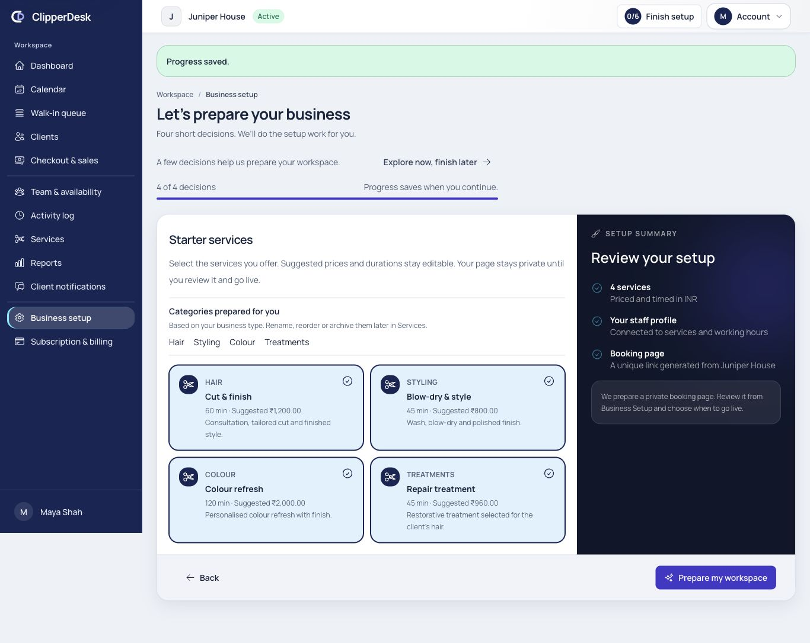
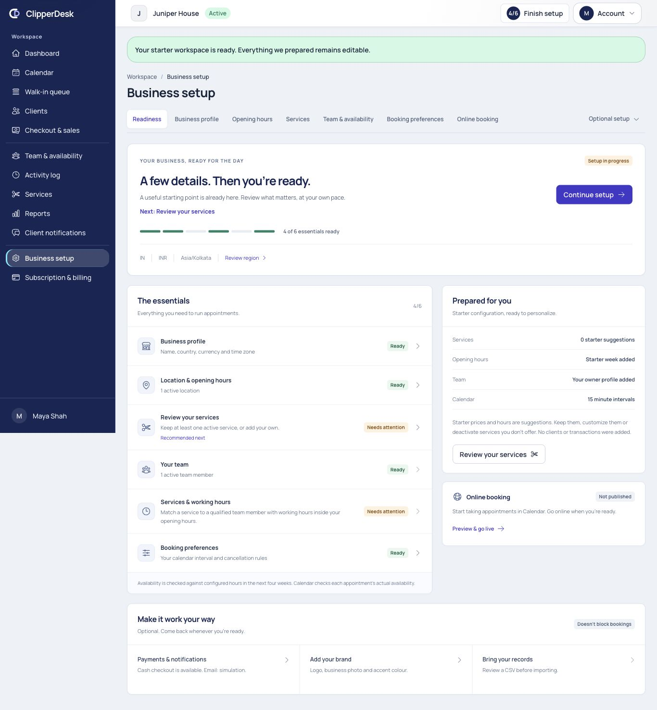
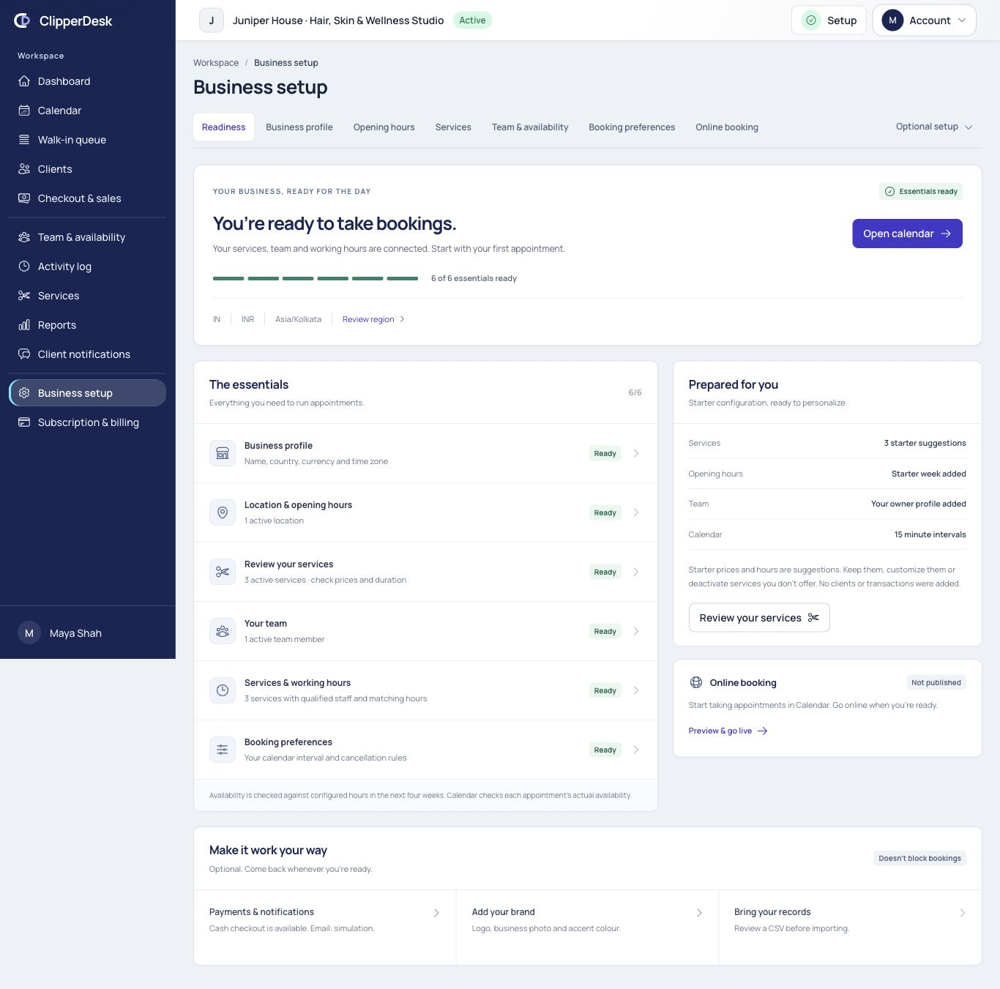
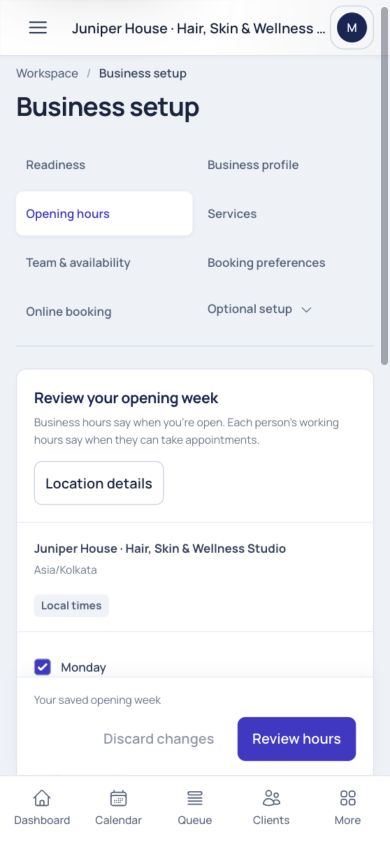
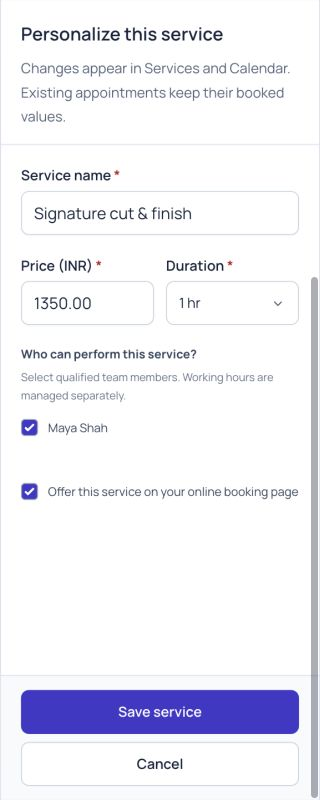
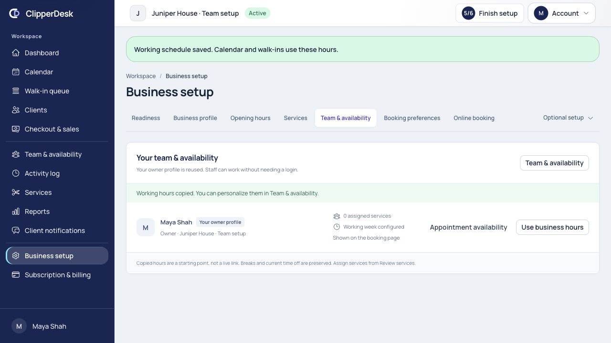
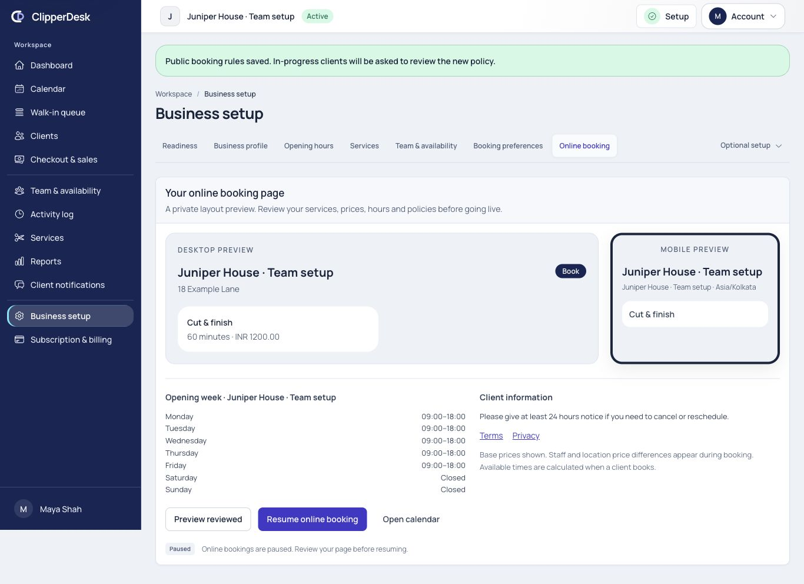
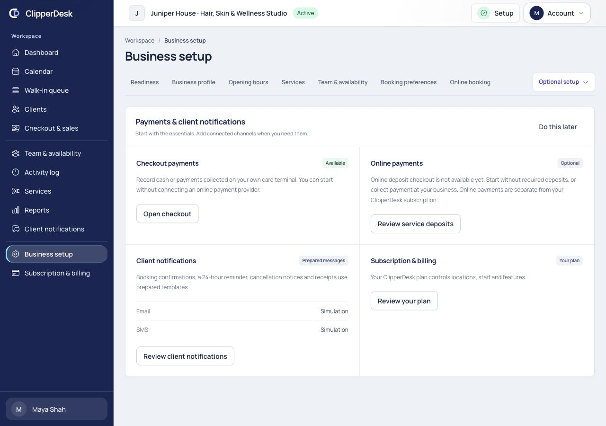
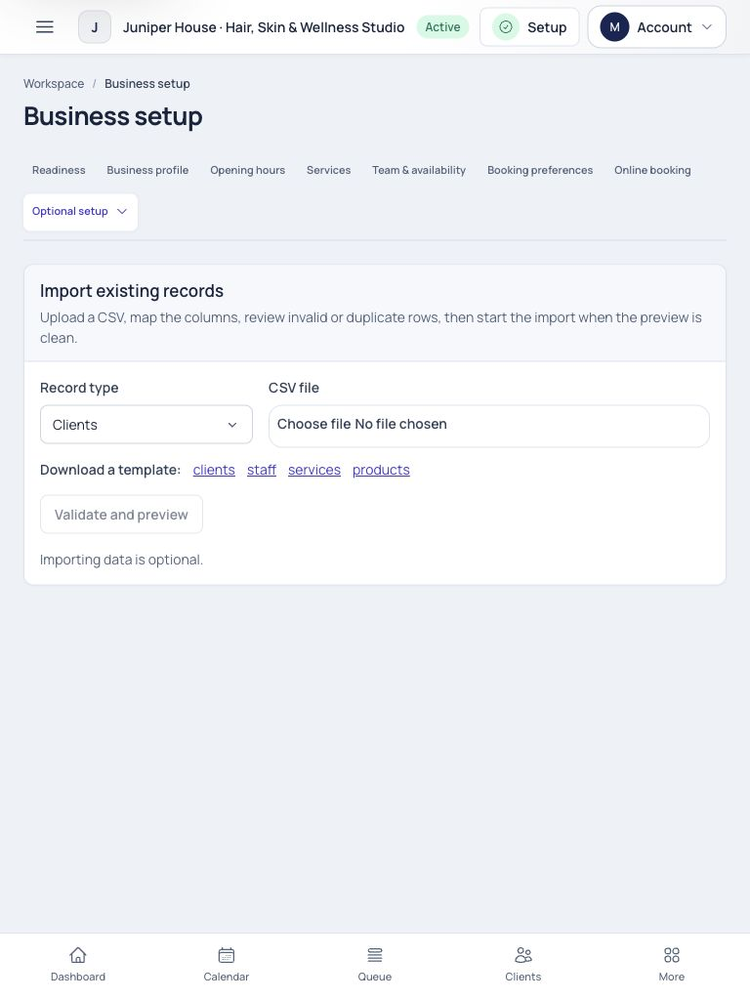

# Business setup — implementation and review

Review started 2026-10-04; verification completed 2026-10-05 (Asia/Kolkata).
Applied directly in `/Applications/AMPPS/www/barber_app`.
Specification: [Business setup](../../modules/business-setup.md).
Approved product clarification: FR-02 and ADR-053.

## Outcome

Business setup is now a persistent operational readiness center with six meaningful
essentials, one next action, direct focused editing and separate online publication.
The existing four saved decisions and prepared starter data remain. Preparation
stays private; explicit review and Go live replace automatic publication. Optional
branding, imports and providers do not prevent internal appointments.

The screenshots below are actual browser captures from this review. The initial
existing owner/business on port 8000 was inspected read-only. Saves and publication
were exercised exclusively in a guarded synthetic SQLite fixture on port 8014.
No real clients, messages, appointments, sales or payments were generated. The
primary business was not published or reseeded. Other pending module work was
preserved; no dependency or application migration was introduced.

## What existed and was preserved

| Area | Inspected behavior and resulting boundary |
| --- | --- |
| Signup/business/tenant | Fortify registration records owner intent; verified email initializes the Business, owner membership, location, trial and form templates transactionally. Google registration retains the same owner-intent boundary. Setup uses these canonical models. |
| Starter roles | Owner, Manager, Receptionist, Barber/Stylist and Accountant are real business-scoped roles. Permission and membership isolation remain server-enforced. |
| Services/categories | Version 2 starter profiles cover all 12 supported business types. Small category sets are prepared even when a service is not selected; only selected services are created. Prices, durations and provenance are visible. No change to old businesses when templates evolve. |
| Location/hours | Reuse the default active location; three editable starter schedules: weekdays, Tuesday–Saturday and every day, 09:00–18:00. Closed days and split periods remain supported. Location-local time zones govern scheduling. |
| Owner/team | Reuse one owner StaffProfile. If the owner takes appointments, prepare working rules and eligible assignments. Owner-only setup does not claim bookable availability. Additional staff need no login to perform services. |
| Calendar/statuses | Appointment interval defaults to 15 minutes. Appointment states are the existing domain enum, not duplicated tenant seed records. Actual booking availability remains Calendar's authority. |
| Commerce/tax | New commerce defaults use zero tax and a 24-hour cancellation cutoff. Existing commerce settings are preserved. Tax posture is reviewed in Region & money; no tax or legal approval is inferred. |
| Payments | Cash and payments collected externally remain usable without online-provider connection. Tender types are existing checkout choices rather than duplicated seed rows. Subscription billing is separate. Public deposit checkout remains unavailable under OPEN-16; the setup copy says this explicitly and links to service deposit rules. |
| Notifications | Prepared email/SMS content, booking confirmations, one 24-hour reminder, cancellation and receipts reuse Client notifications. Ten operational rules and two prepared deposit templates retain ADR-052/OPEN-21. Simulation, Needs setup and Sending configured are transport states, not delivered-message certificates. No unsupported mobile channel is added. |
| Client defaults | Six starter form templates remain: Consultation, Allergy declaration, Patch test, Treatment consent, Hair-colour history and Photography consent. No sample clients or operational history are created. |
| Region/branding/import | Country, currency, locale, time zone and week start use the existing catalogues. Currency changes remain frozen once commerce/catalogue history exists. Private brand uploads retain plan and tenant controls. CSV template/mapping/preview/duplicate/job behavior is reused. |
| Memberships/packages | Phase 2 remains deferred; no seed records or onboarding controls were introduced. |

## Findings addressed

The former overview mixed publication blockers with everyday readiness, used
completion state that could outlive real configuration, and hid practical edits
behind a long settings surface. Starter completion also marked the preview reviewed
and automatically published. Useful initialization existed, but prices/provenance,
optional connections and safe first-use actions needed clearer presentation.

The implementation now checks current profile/region, branch hours, valid services,
active staff, qualified assignment/branch/resource/working-hour paths, and booking
interval/cancellation window. Dated qualifications and working rules cannot count
after expiry. Online visibility is checked separately. Configuration is evaluated
in the next four weeks; readiness does not promise a free slot or full bookability
of every listed service. Attention labels identify other services needing work.

Important safety fixes include business-first locks, terminal completion guards,
empty selection support, rollback and retry recovery, preservation of commerce and
existing categories/hours, and rejection of starter restoration over published or
operational history. Profile/commerce/slug changes save atomically with a revision.
Hours review binds exact windows to the current location revision, upcoming
appointment versions and expiring preview, rechecks holds, preserves booked visits
and audits once on exact replay. Service and team edits reuse the reviewed domain
commands and preserve existing advanced values. Meaningful Activity events receive
plain labels; navigation/review clicks do not create configuration-change events.

Business-wide settings require appropriate authority and every-location access
for a settings-capable non-owner. Branch managers keep their scoped Team/Services
workspaces. The shared summary is not sent to unauthorized memberships.

## Reviewed flow

1. **Introduction and starter preparation — good.** Four saved decisions remain.
   Public contact details are optional until publication. Refresh resumed decision
   2; Explore and Continue introduction worked. Suggested prices/categories and
   editable owner/hours are clear. Empty selection completed with 4/6 essentials,
   zero services and a private page, without putting suggestions back.

   

   

2. **Readiness and first-use bridge — strong.** The six essentials derive from
   current configuration, show a reason and one next action, and separate optional
   work. Completed essentials lead into Calendar. Long business names wrap/truncate
   without horizontal page overflow. Tablet cards keep their natural height.

   

3. **Business profile and opening week — good.** Three profile groups reduce form
   fatigue; required/publication fields, explicit saving and dirty navigation are
   clear. The direct Review region action opens Region & money. Weekly hours use
   labeled local time fields, closed days, split periods and independent copy.
   A backwards end time produced an actionable error; corrected Monday hours saved
   with feedback. Mobile save controls sit immediately above the bottom navigation.

   

4. **Services and team availability — good.** Compact searchable service rows and
   a focused drawer expose price, duration, qualified staff and online visibility.
   A service rename/price save and new assignment used the canonical catalogue.
   Availability changes preserve login access; closing a dirty editor requests
   discard. Copying business hours used exact Team review/save, then assignment
   changed readiness from 5/6 to 6/6 immediately.

   

   

5. **Booking preferences and online publication — good.** Calendar interval is
   directly editable here; advanced waitlist/link settings use disclosure. The
   private layout preview shows valid online paths, opening week, policies and
   base-price context. It does not invent slots. Explicit review unlocked Go live;
   the synthetic tenant transitioned to Live, Paused and Live again. Existing
   publication timestamps and repeat audit behavior are protected by tests.

   

6. **Optional connections, branding and imports — clear, with existing limits.**
   Cash/manual operation, online deposits and subscription billing are distinct.
   Email/SMS show simulation honestly. Prepared messages link to Client
   notifications. Brand images and CSV import stay optional; Do this later returns
   to readiness. The pre-existing online deposit interface is still unavailable;
   provider sending and regional legal approval were not exercised or inferred.

   

   

## Responsive and accessibility review

Inspected 320, 390, 768, 1024, 1280, 1366 and 1920 pixel widths. Observed document
width matched the viewport at checked narrow/tablet/laptop sizes. Shared Manrope,
blue shell, surfaces, icons, buttons, selects and focused dialogs are retained.
Mobile checklist states sit below descriptions; schedules use 44-pixel time
controls, drawers fill the viewport and save controls clear navigation. A tablet
card stretch and mobile sticky-save overlap were corrected during review.

Visible focus, labeled fields, keyboard-addressable controls, dialog focus/escape,
radio focus outlines, accessible essential counts, time error associations and
textual status reasons were inspected. Color is not the sole status indicator.
Native time rendering follows browser locale. No full WCAG or screen-reader
certification is claimed: formal assistive-technology, zoom, real-device soft
keyboard and complete contrast measurements remain separate checks.

Fixed navigation appears at the original viewport boundary in some full-page
captures; use the viewport screenshot `19-mobile-sticky-save.png` for its actual
relationship to the save bar. Intermediate screenshots 01–11 preserve baseline
and earlier save/validation observations; the accepted final flow above is the
primary evidence. No generated image substitutes for a captured product screen.

## Six-perspective review

| Perspective | Assessment |
| --- | --- |
| First-time, nontechnical salon owner | Good: ready/attention/optional language, a visible next action and prepared provenance make the task understandable. Public contacts, providers and branding no longer block internal appointments. Five-second comprehension is a design assessment, not a measured user study. |
| Experienced owner migrating | Good: import stays available and reviewed, existing records count toward readiness, advanced modules remain accessible. No destructive reset is offered over real configuration. Actual migration files were not used in this review. |
| Solo barber | Good: reuse one owner, assign services and copy a working week. No extra employee, logo or Stripe connection is required. Calendar is the completion action. |
| Multi-staff salon | Good: active membership, qualification, branch and working-hour paths determine readiness. Services/Team handle advanced staff variants, invitations, dated exceptions and reviewed impact. “6/6” means at least one operational delivery path, not every service or branch fully configured. |
| Senior product designer | Good: mature compact surfaces, restrained progress, concise guidance, focused editors and responsive reflow. Remaining accessibility certification and representative usability testing are explicit; no invented conversion/time-to-value result is claimed. |
| Senior engineer | Good in automated/local evidence: initialization rollback/retry, stale revisions, exact replay, hold/appointment impact, tenant/branch authority and bounded reads are covered. SQLite and browser QA do not certify concurrent production MySQL behavior or live providers. |

## Verification

- Full PHP suite: **513 passed / 5,311 assertions**, **28 existing intentional
  skips**. Baseline was 479 / 5,132 / 28.
- New BusinessSetupReadinessTest: **34 passed / 165 assertions** covering broken
  paths, public/internal separation, current dates, empty suggestions, recovery,
  preserved defaults/history, atomic slug rollback, stale profiles/preferences,
  reviewed split hours, payload mismatch, expiry, changed appointments, active
  holds, exact replay, tenant/branch restrictions and 51-service bounded queries.
- Guided onboarding tests retain all 12 business types, selected categories,
  regional defaults, retry and private-until-review/publication behavior.
- Frontend: **59 passed**, including split/closed-day conversion and independent
  weekday copy. Existing shared module checks remain passing.
- Node **24.19.0** client and SSR production builds pass. All **17 route asset
  budgets** pass. Scoped PHP formatting and whitespace checks pass.
- The existing notification history test now uses a fixed clock, so its local
  date assertion does not fail when the review moves past 2026-10-04.
- Browser saves: synthetic service customization/assignment, hours validation/save,
  team visibility and copied working hours, calendar interval, explicit preview,
  publication, pause/resume, resumed introduction and zero selected suggestions.
- Brand upload/import backend contracts remain covered by existing tests; this
  browser review inspected their layout/optional navigation without sending a
  real brand image or importing real records.

Reproduction uses `BusinessSetupReviewSeeder`, guarded to a testing SQLite path
containing `business-setup-review`, fake communications and array cache. The review
server explicitly uses `CACHE_STORE=array` so permission caches cannot be shared
with the main local database. The initial fixture cache mismatch was resolved by
isolating the review cache; the fixture now requires array cache. The main local
permission cache was reset after review; no production role change was needed. The isolated
server is stopped after QA. Test logs are in `/tmp/setup-*-tests.log`; build,
formatting and budget logs also use `/tmp/setup-*`.

Existing OPEN-13/15/16/19/20/21 and release gates remain. Date-effective opening
records are preserved and reject current-week replacement; advanced dated/overnight
editing remains bounded by OPEN-19. No starter-reset button was added: the optional
request would otherwise require a supported reset/recovery contract that cannot
overwrite real salon configuration. Phase 2 memberships/packages remain deferred.
