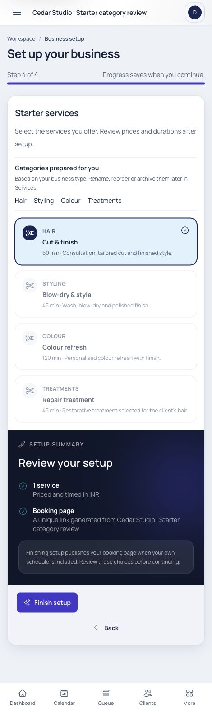
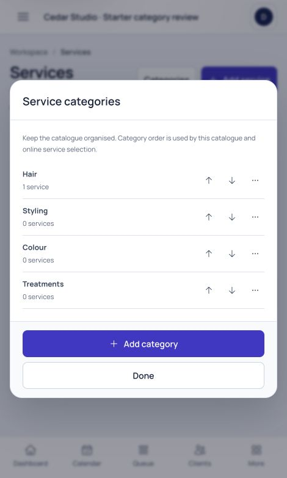
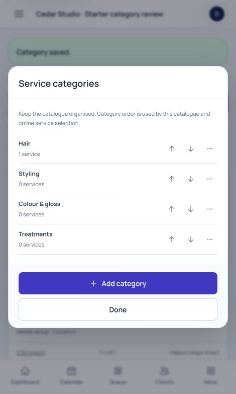

# Business-type starter categories

Date: 2026-10-04. Requirements: FR-02/FR-04. Decision: ADR-050.
Specification: [Services](../../modules/services.md).

The existing onboarding service templates already carried category names, but
only the categories of selected services were created. The confirmed starter
workspace now prepares the small configured category set for the chosen business
type, including empty groups, without adding unselected services.

| Business type | Starter categories |
| --- | --- |
| Hair salon | Hair, Styling, Colour, Treatments |
| Barbershop | Haircuts, Grooming, Combined services |
| Nail studio | Manicure, Pedicure, Nail art |
| Beauty studio | Brows, Lashes, Skin, Waxing, Makeup |
| Spa & sauna | Massage, Body treatments, Facials, Facilities |
| Massage practice | Massage, Recovery |
| Wellness & recovery | Consultations, Recovery, Mobility |
| Skin & aesthetics | Consultations, Facials |
| Makeup & bridal | Makeup, Bridal |
| Independent professional | Appointments |
| Multi-service business | Consultations, Signature services, Appointments |
| Another appointment business | Appointments |

Definitions share `config/business-onboarding.php` with service templates. Only
new, owner-confirmed starter setup with no existing standalone services creates
the sets. Existing categories are reused within the tenant case-insensitively,
keeping original names, display order and archive choices. Missing groups append
in configured order. A service placed in an already archived group stays inactive
and internal. Generated new-category IDs and audit count use the existing atomic
starter transaction; completed retries do not create more categories or reset edits.
Existing/completed businesses are not backfilled or changed when their type changes.

## Browser evidence

Isolated synthetic SQLite review fixture: Cedar Studio · Starter category review,
using the existing synthetic owner. One Cut & finish service was selected during
hair-salon onboarding with owner bookability off; setup stayed unpublished under
the existing readiness rules. No real account, invitation or payment was changed.
The browser confirmed four categories with counts 1/0/0/0. Colour was renamed to
Colour & gloss through Services and the saved result appeared immediately.

1. Category preview alongside selected services — pass.
2. Confirmed setup creates selected service plus empty category groups — pass.
3. Category customization through existing Services controls — pass.

Screenshots were saved and inspected at the native 470-pixel browser width.
The full-page onboarding capture includes the confirmation/footer context;
category captures show the existing modal and saved names. This small addition
uses a wrapping text list and shared controls, not a new interaction component.

## Verification

- `php artisan test --filter=GuidedOnboardingExperienceTest`: **18 passed /
  181 assertions**. Includes all 12 profiles, correct selected-service mapping,
  empty groups/order, preservation of tenant category names/archive/order,
  cross-tenant reuse protection, existing-catalogue safeguards, HTTP rename/archive
  and completed-retry preservation.
- `php artisan test --compact`: **440 passed / 4,837 assertions**, 28 existing skips.
- Client/SSR production builds pass. Scoped PHP formatting and whitespace checks
  pass. No migration, dependency, financial history or package feature introduced.
- Verification uses local tests and a synthetic browser fixture; no production
  backfill was run. Current onboarding price suggestions/readiness/publication
  rules remain the existing contracts. Combined services is a category for the
  single haircut/beard appointment, not prepaid-package eligibility.
